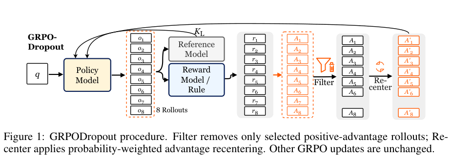

# grpo-dropout：GRPODropout: Less is More for Online Reinforcement Learning Rollouts

> 核心机制实现；短预算真实 checkpoint 运行只验证训练链路，不等同论文规模能力复现。

## 论文信息

| 字段 | 内容 |
|---|---|
| 论文链接 | [原文](https://arxiv.org/abs/2610.11854) |
| 公司 / 机构 | Harbin Institute of Technology (Shenzhen)（第一作者署名） |
| 首次公开日期 | 2026-10-08（arXiv v1） |
| 原作者代码 | [已开源](https://github.com/hexuandeng/GRPODropout) |
| 本地 adapter / 方法（Adapter） | `grpo-dropout` |
| 本地复现代码 | [oct10_objectives.py](https://github.com/daiwk/auto-research/blob/main/src/auto_research/post_training/oct10_objectives.py)、[oct10_checkpoint.py](https://github.com/daiwk/auto-research/blob/main/src/auto_research/post_training/oct10_checkpoint.py) |

## 原始论文总结

### 背景与主要改动

从同一 prompt 的 GRPO 响应组中筛除部分高概率、正优势响应，并用旧策略概率重新中心化保留响应的优势。不是随机 dropout，也不改变生成预算。

<!-- paper-figure:start -->
### 原论文关键图

> **原论文 Figure 1（关键图）**：从同问题的 rollout 组中选择性过滤正优势样本，再按概率权重重新中心化剩余优势；其余 GRPO 更新路径保持不变。图片来自[原论文](https://arxiv.org/abs/2610.11854)，版权归原作者所有；点击图片可查看来源。
<!-- paper-figure:end -->

### 核心公式

$s_g=-\sum_t\log p_{g,t}/T_g$，$h_g=A_g(s_g-\bar s)/G$。按最负贡献先删除，随后恢复所有 $A_g\le0$；$b=\sum_{keep}e^{-s_g}A_g/\sum_{keep}e^{-s_g}$，使用 $A_g-b$ 更新。

### 论文离线与线上效果

原文三个模型、十个 benchmark 的平均收益为 1.55 个百分点；最终恢复非正优势响应后，不保证筛选集合仍满足最初的熵约束。未报告线上 A/B。

## 本地复现

完整安装、数据格式和命令见[checkpoint 运行说明](../oct10-checkpoint-guide.md)。

核心入口为 `grpo_dropout / clipped_actor_loss`；实际 checkpoint 命令入口是 `scripts/run_oct10_post_training.py --objective grpo-dropout`。

必须显式提供本地 checkpoint 路径、公开模型 ID/revision、公开 GSM8K train/validation JSONL、数据 revision 和输出目录；运行 `python scripts/run_oct10_post_training.py --help` 查看完整参数。不自动下载或上传私有数据。教师与学生必须逐 token 词表一致；只支持含 q_proj/v_proj 的因果 LM，基础参数冻结，LoRA 实际训练。

### 数据协议与结果

生成器只读取问题。答案只用于外部数值验证器。训练与验证问题重叠会报错；训练后才执行隔离验证，不据验证选择超参。报告保存 seed、数据哈希、checkpoint revision、token 数、loss 和实际参数变化。

NVIDIA A100 实际执行 Qwen3-4B 学生、公开 GSM8K train 的前 10 题、每题 4 个随机响应，最长 512 token（seed 42）。第 5 题出现 0.75 组均奖励、0.1875 奖励方差和非零学生梯度 0.118643；其余多数组奖励相同，因此 10 步只有 1 步有效策略梯度。参数变化 L2 0.028784；不能仅凭参数变化判定有效训练，因为 AdamW 的权重衰减也会改变参数。

该固定运行未触发响应删除（最少仍保留 4 条）；删除分支由公式测试覆盖，不虚报该 GPU 运行验证了删除收益。隔离验证仅 2 题全部正确，不足以证明能力提升。详见 [实际指标](metrics/checkpoint-a100-seed42.json) 和 [脱敏 GPU 证据](../../gpu-validations/grpo-dropout-a100-20261010.json)。短生成截断、少量问题和单 seed 只支持 runtime smoke。

另将相同固定 train 顺序扩大至 12 题：[seed 42](metrics/checkpoint-a100-seed42-12.json) 仍未触发删除；[seed 43](metrics/checkpoint-a100-seed43-12.json) 第 5 题真实保留 1/4 条响应，筛选分支已执行。该步保留的单条负优势被重新中心化为 0，因此该 seed 没有有效策略梯度；这是实际负结果，不把“运行成功”写成“模型提升”。两 seed 未用于超参或 test 选择，也不合并为正式比较。

### 代码映射与复现边界

公式和选择器位于 `oct10_objectives.py`，LoRA/rollout/教师评分/优化/验证位于 `oct10_checkpoint.py`，契约测试位于 `tests/test_oct10_objectives.py` 和 `tests/test_oct10_checkpoint_contracts.py`。没有完成论文原训练数据、完整训练预算和多 benchmark 对照；未接入 Evolve 多轮控制器，不把方法索引标签当作 Evolve 集成。
