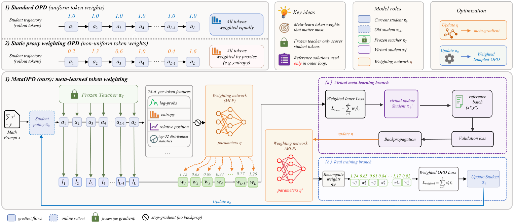

# meta-opd：MetaOPD: Meta-Learned Token Weighting for On-Policy Distillation

> 核心机制实现；短预算真实 checkpoint 运行只验证训练链路，不等同论文规模能力复现。

## 论文信息

| 字段 | 内容 |
|---|---|
| 论文链接 | [原文](https://arxiv.org/abs/2610.11989) |
| 公司 / 机构 | East China Normal University（第一作者署名） |
| 首次公开日期 | 2026-10-08（arXiv v1） |
| 原作者代码 | 截至 2026-10-10 未发现 / 未发布原作者代码 |
| 本地 adapter / 方法（Adapter） | `meta-opd` |
| 本地复现代码 | [oct10_objectives.py](https://github.com/daiwk/auto-research/blob/main/src/auto_research/post_training/oct10_objectives.py)、[oct10_checkpoint.py](https://github.com/daiwk/auto-research/blob/main/src/auto_research/post_training/oct10_checkpoint.py) |

## 原始论文总结

### 背景与主要改动

轻量权重网络根据师生预测学习 token 监督权重。它通过一次可微虚拟学生更新后的参考解损失获得元梯度，再使用新权重执行真实学生更新。

<!-- paper-figure:start -->
### 原论文关键图

> **原论文 Figure 2（关键图）**：冻结教师给学生采样 token 打分；权重网络先通过虚拟学生更新和参考验证损失获得元梯度，再重新计算 token 权重并更新真实学生。参考答案只出现在外层验证分支。图片来自[原论文](https://arxiv.org/abs/2610.11989)，版权归原作者所有；点击图片可查看来源。
<!-- paper-figure:end -->

### 核心公式

$\theta'=\operatorname{AdamW}(\theta,\nabla_\theta\mathcal L_{\mathrm{OPD}}(\theta,w_\phi))$；$\phi\leftarrow\phi-\eta\nabla_\phi[\mathcal L_{\mathrm{ref}}(\theta')+\lambda\|w-1\|^2]$。权重先逐响应中心化，再做 $1+\rho\tanh$ 和单位均值归一化。

### 论文离线与线上效果

原文报告两个学生规模上的 Avg@8 / Pass@8 收益；本地不将这些收益当作测得结果。未报告线上 A/B。

## 本地复现

完整安装、数据格式和命令见[checkpoint 运行说明](../oct10-checkpoint-guide.md)。

核心入口为 `meta_opd_descriptor / virtual_adamw / meta_opd_step`；实际 checkpoint 命令入口是 `scripts/run_oct10_post_training.py --objective meta-opd`。

必须显式提供本地 checkpoint 路径、公开模型 ID/revision、公开 GSM8K train/validation JSONL、数据 revision 和输出目录；运行 `python scripts/run_oct10_post_training.py --help` 查看完整参数。不自动下载或上传私有数据。教师与学生必须逐 token 词表一致；只支持含 q_proj/v_proj 的因果 LM，基础参数冻结，LoRA 实际训练。

### 数据协议与结果

生成器只读取问题。答案只用于外部数值验证器及独立的训练参考解流；该流不是 benchmark test 数据。训练与验证问题重叠会报错；训练后才执行隔离验证，不据验证选择超参。报告保存 seed、数据哈希、checkpoint revision、token 数、loss 和实际参数变化。

NVIDIA A100 上已执行真实 Qwen3-4B 学生与公开 MOPD 教师的 LoRA 训练（seed 42，2 步）。学生有效梯度步数 2，adapter 参数变化 L2 为 0.019273。隔离验证仅 2 题，exact match 为 0.5；不能据此宣称收益。详见 [实际指标](metrics/checkpoint-a100-seed42.json) 和 [脱敏 GPU 证据](../../gpu-validations/meta-opd-a100-20261010.json)。

短生成截断、少量问题和单 seed 只支持 runtime smoke，不支持数学能力提升结论。

### 代码映射与复现边界

公式和选择器位于 `oct10_objectives.py`，LoRA/rollout/教师评分/优化/验证位于 `oct10_checkpoint.py`，契约测试位于 `tests/test_oct10_objectives.py` 和 `tests/test_oct10_checkpoint_contracts.py`。没有完成论文原训练数据、完整训练预算和多 benchmark 对照；未接入 Evolve 多轮控制器，不把方法索引标签当作 Evolve 集成。
