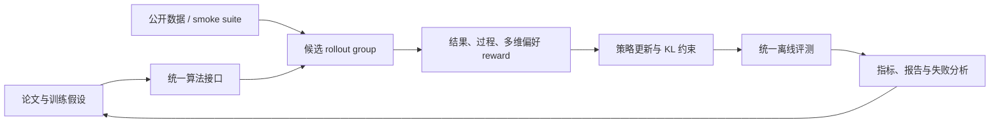

# LLM 后训练研究

这里是[论文实现与评测库](../research-library.md)中的纯 LLM 后训练分支，覆盖偏好优化、
在线强化学习、on-policy distillation、过程奖励和数据闭环。这里先建立可信算法组件
与公共评测；成熟组件可以继续接入[自动进化](../evolution-domains.md)，和网络结构、
预训练数据及超参数一起搜索。

!!! info "复现保真度"
    候选策略 suite 用于低成本回归；IPO、SimPO、LUSPO、CoBA-RL 已升级为字符
    tokenizer + causal LM 的**真实自由生成路径**，包含完整 sequence log-probability、
    verifier、rollout 和多 seed。两种保真层级分别报告，均不冒充论文中的大模型训练。

## 快速入口

- [自动进化中的纯 LLM](../evolution-domains.md)：查看结构、数据和后训练的组合方式。
- [方法索引](catalog.md)：按研究方向查看基线、已实现论文、原作者代码和本地入口。
- 分类浏览：[按公司 / 机构 / 学校](catalog/by-institution.md) ·
  [按主题](catalog/by-topic.md) · [按年份](catalog/by-year.md)。
- [论文谱系与缺口](lineage.md)：系统审计已覆盖主干、P1 缺口和下一步评测前置条件。
- [统一评测协议](benchmark.md)：数据、指标、公平比较口径和新增方法验收标准。
- [DPO](2305.18290-dpo/README.md)：reference-relative 偏好分类，无 reward model。
- [KTO](2402.01306-kto/README.md)：只需单条 desirable/undesirable 标签的前景理论目标。
- [ORPO](2403.07691-orpo/README.md)：SFT 与 odds-ratio 偏好合一，无 reference model。
- [DeepSeekMath / GRPO](2402.03300-grpo/README.md)：组相对、critic-free 的 reasoning RL。
- [TIS](web-2025-tis/README.md)：单侧截断训练/rollout 引擎概率比，校正训推失配。
- [IcePop](2510.18855-icepop/README.md)：以固定双侧 ratio mask 丢弃严重失配 token。
- [Online IcePop](web-2025-online-icepop/README.md)：每批 rollout 只更新一次，移除
  stale-policy ratio 与 PPO clip。
- [RIPO](2607.10169-ripo/README.md)：按旧策略概率自适应的 Fisher–Rao 几何 clip。
- [KPop](2606.15079-kpop/README.md)：以双向 binary-KL 掩码处理异步训推失配。
- [GPPO](2508.07629-gppo/README.md)：PPO 前向保持 clip、反向保留越界样本梯度。
- [Dr. GRPO](2503.20783-dr-grpo/README.md)：移除长度与组方差归一化的 group update。
- [ARMOR](2607.10481-armor/README.md)：混入 reference anchor rollout 防止长程退化。
- [REINFORCE++](2501.03262-reinforce-plus/README.md)：用全局优势尺度取代 prompt-local 方差。
- [TACO](2607.07976-taco/README.md)：只衰减高尾部风险 token 的正向信用。
- [CHORD](2508.11408-chord/README.md)：退火式协调 expert SFT 与 on-policy RL。
- [VAPO](2504.05118-vapo/README.md)：length-adaptive GAE 的 critic PPO。
- [InstructGPT / PPO-RLHF](2203.02155-ppo-rlhf/README.md)：旧策略、critic、clip 与 KL 的经典 RLHF。
- [RLOO](2402.14740-rloo/README.md)：完整响应级 leave-one-out REINFORCE。
- [ReMax](2310.10505-remax/README.md)：以 greedy rollout 作 baseline 的 value-free RLHF。
- [GKD](2306.13649-gkd/README.md)：学生自生成轨迹、教师密集反馈与 on/off-policy 混合。
- [MiniLLM](2306.08543-minillm/README.md)：reverse KL、teacher-mixed sampling 与方差缩减。
- [OPSD](2601.18734-opsd/README.md)：用同一模型的特权解题上下文作教师，对学生
  on-policy 轨迹做逐 token 自蒸馏与 pointwise clipping。
- [OPCD](2602.12275-opcd/README.md)：让无上下文学生拟合带经验/系统提示的上下文教师，
  把测试时上下文能力蒸馏进参数。
- [DAPO](2503.14476-dapo/README.md)：Clip-Higher、动态采样、token loss 与过长惩罚。
- [GSPO](2507.18071-gspo/README.md)：长度归一化的 sequence-level importance ratio。
- [Lightning OPD](2604.13010-lightning-opd/README.md)：离线缓存教师分布的 on-policy distillation。
- [GPRL](2605.18721-gprl/README.md)：多维偏好的 group-relative 强化学习。
- [TCR](2607.19824-tcr/README.md)：thinking checklist 与残差过程奖励。
- [IPO](2310.12036-ipo/README.md)：有限 preference log-ratio gap 的平方回归。
- [SimPO](2405.14734-simpo/README.md)：reference-free、长度归一化偏好目标。
- [LUSPO](2602.05261-luspo/README.md)：校正 sequence policy objective 的长度偏差。
- [CoBA-RL](2606.22317-coba-rl/README.md)：能力边界探测、教师引导与课程 RL。
- [Constitutional AI](2212.08073-constitutional-ai/README.md)：自我批评/修订与 AI preference RLAIF。
- [RRHF](2304.05302-rrhf/README.md)：全响应 reward ranking 与 best-response SFT。
- [RAFT](2304.06767-raft/README.md)：当前策略采样、reward 选优与迭代 SFT。
- [SLiC-HF](2305.10425-slic-hf/README.md)：序列 likelihood margin 与监督正则。
- [SteerLM](2310.05344-steerlm/README.md)：多属性标注、条件 SFT 与推理时可控目标。
- [SPIN](2401.01335-spin/README.md)：上一轮策略自生成负例与迭代自博弈。
- [Relay-OPD](2607.26057-relay-opd/README.md)：检测失败前缀并让教师有限接力。
- [β-OPSD](2607.28582-beta-opsd/README.md)：把 KL 正则策略最优解转成可调几何插值蒸馏目标。
- [Flux-OPD](2607.28022-flux-opd/README.md)：以稳定 teacher 为锚，按上下文冲突衰减演化修正。
- [CoRT](2607.25659-cort/README.md)：用反事实重放分配 token 级 rubric credit。
- [ReCo](2607.26862-reco/README.md)：按响应期望出现次数与 token 方差比重加权 GRPO。

## 研究闭环



## 当前实现

| 类别 | 方法 | 核心机制 | 公开评测 | 状态 |
|---|---|---|---|---|
| 直接偏好优化 | [DPO](2305.18290-dpo/README.md) | reference-relative pairwise classification | GSM8K candidate | 机制复现 |
| 二元反馈对齐 | [KTO](2402.01306-kto/README.md) | prospect utility、desirable/undesirable、KL 参照点 | GSM8K candidate | 机制复现 |
| 单阶段偏好 | [ORPO](2403.07691-orpo/README.md) | SFT NLL + odds-ratio penalty，无 reference | GSM8K candidate | 机制复现 |
| 在线推理 RL | [GRPO](2402.03300-grpo/README.md) | group advantage、old-policy clip、KL，无 critic | GSM8K candidate | 机制复现 |
| 训推失配校正 | [TIS](web-2025-tis/README.md) | training/rollout ratio、单侧上截断、保留低 ratio | GSM8K candidate | 机制复现 |
| MoE 训推失配 | [IcePop](2510.18855-icepop/README.md) | fixed two-sided ratio mask、区间内原始 IS 权重 | GSM8K candidate | 机制复现 |
| 纯在线训推校正 | [Online IcePop](web-2025-online-icepop/README.md) | 单次 rollout update、policy ratio=1、IcePop mask | GSM8K candidate | 机制复现 |
| 几何信任域 | [RIPO](2607.10169-ripo/README.md) | probability-dependent Fisher–Rao clip | GSM8K candidate | 机制复现 |
| 异步训推失配 | [KPop](2606.15079-kpop/README.md) | 双向 binary-KL keep/mask | GSM8K candidate | 机制复现 |
| 梯度保留 clip | [GPPO](2508.07629-gppo/README.md) | clipped forward、boundary-weighted backward | GSM8K candidate | 机制复现 |
| GRPO 聚合偏置 | [Dr. GRPO](2503.20783-dr-grpo/README.md) | group mean、无长度和组 std 归一化 | GSM8K candidate | 机制复现 |
| Reference anchor | [ARMOR](2607.10481-armor/README.md) | frozen-reference 与 on-policy mixed rollout | GSM8K candidate | 机制复现 |
| 全局优势估计 | [REINFORCE++](2501.03262-reinforce-plus/README.md) | EMA global advantage scale | GSM8K candidate | 机制复现 |
| Token 信用 | [TACO](2607.07976-taco/README.md) | tail-risk 降低正 advantage | GSM8K candidate | 机制复现 |
| SFT-RL 混合 | [CHORD](2508.11408-chord/README.md) | decayed expert SFT + group RL | GSM8K candidate | 机制复现 |
| Critic PPO | [VAPO](2504.05118-vapo/README.md) | length-adaptive GAE 与 actor-critic | GSM8K candidate | 机制复现 |
| 经典在线 RL | [PPO-RLHF](2203.02155-ppo-rlhf/README.md) | old policy、clipped surrogate、critic、KL | GSM8K candidate | 机制复现 |
| 经典在线 RL | [RLOO](2402.14740-rloo/README.md) | response-level REINFORCE、leave-one-out baseline | GSM8K candidate | 机制复现 |
| 经典在线 RL | [ReMax](2310.10505-remax/README.md) | sampled reward 减 greedy reward，无 critic | GSM8K candidate | 机制复现 |
| 经典 On-policy KD | [GKD](2306.13649-gkd/README.md) | 学生 rollout、教师反馈、on/off-policy 混合 | GSM8K candidate | 机制复现 |
| 生成模型蒸馏 | [MiniLLM](2306.08543-minillm/README.md) | reverse KL、teacher mix、variance baseline | GSM8K candidate | 机制复现 |
| On-policy 自蒸馏 | [OPSD](2601.18734-opsd/README.md) | 特权解题上下文、学生 rollout、逐 token divergence 与 clip | GSM8K candidate | 机制复现 |
| 上下文蒸馏 | [OPCD](2602.12275-opcd/README.md) | context-conditioned teacher、context-free student、reverse KL | GSM8K candidate | 机制复现 |
| 长推理 RL | [DAPO](2503.14476-dapo/README.md) | 非对称 clip、动态采样、token loss、overlong shaping | GSM8K candidate | 机制复现 |
| 稳定序列 RL | [GSPO](2507.18071-gspo/README.md) | sequence ratio、group advantage、序列级 clip | GSM8K candidate | 机制复现 |
| 蒸馏 | [Lightning OPD](2604.13010-lightning-opd/README.md) | SFT rollout 上预计算教师分布，训练期零在线教师调用 | 同上 | 机制复现 |
| 多目标 RL | [GPRL](2605.18721-gprl/README.md) | 分维度 group normalization 与漂移控制 | 同上 | 机制复现 |
| 过程奖励 | [TCR](2607.19824-tcr/README.md) | thinking checklist、EMA 残差奖励 | 同上 | 机制复现 |
| 离线偏好 | [IPO](2310.12036-ipo/README.md) | reference-relative gap 平方回归 | arithmetic / GSM8K free generation | token 级复现 |
| 离线偏好 | [SimPO](2405.14734-simpo/README.md) | 长度归一化、reference-free margin | arithmetic / GSM8K free generation | token 级复现 |
| 长度无偏 RL | [LUSPO](2602.05261-luspo/README.md) | length-unbiased sequence ratio | arithmetic / GSM8K free generation | token 级复现 |
| 课程 RL | [CoBA-RL](2606.22317-coba-rl/README.md) | 动态能力边界与 teacher guidance | arithmetic / GSM8K free generation | token 级复现 |
| AI 反馈安全对齐 | [Constitutional AI](2212.08073-constitutional-ai/README.md) | constitution critique/revision + AI preference | GSM8K candidate | 机制复现 |
| 全排序偏好 | [RRHF](2304.05302-rrhf/README.md) | reward ordering、ranking hinge、best SFT | GSM8K candidate | 机制复现 |
| 选优微调 | [RAFT](2304.06767-raft/README.md) | policy sampling、reward top-1 filtering、SFT | GSM8K candidate | 机制复现 |
| 序列校准 | [SLiC-HF](2305.10425-slic-hf/README.md) | preference margin、SFT/reference regularization | GSM8K candidate | 机制复现 |
| 可控 SFT | [SteerLM](2310.05344-steerlm/README.md) | 多属性 annotation 与条件生成目标 | GSM8K candidate | 机制复现 |
| 自博弈 | [SPIN](2401.01335-spin/README.md) | previous-policy negative、偏好更新、对手刷新 | GSM8K candidate | 机制复现 |
| On-policy distillation | [Relay-OPD](2607.26057-relay-opd/README.md) | 失败前缀触发、教师有限接力、学生恢复 | GSM8K candidate | 机制复现 |
| On-policy self-distillation | [β-OPSD](2607.28582-beta-opsd/README.md) | reference/teacher 几何插值与 return-to-go | GSM8K candidate | 机制复现 |
| Context distillation | [Flux-OPD](2607.28022-flux-opd/README.md) | context-free anchor、差分修正与冲突权重 | GSM8K candidate | 机制复现 |
| Token credit | [CoRT](2607.25659-cort/README.md) | rubric/criteria-free 反事实重放与 token 权重 | GSM8K candidate | 机制复现 |
| 分布保持 RL | [ReCo](2607.26862-reco/README.md) | 响应次数权重、token 方差比与 clipped group update | Arithmetic / GSM8K candidate | 机制复现 |

## 公开实验快照

固定 GSM8K candidate 512/128 train/validation examples、300 steps、seed 42。
指标是六候选 exact-answer 策略准确率，**不是自由生成 Pass@1**。

| 方法 | 训练前 accuracy | 训练后 accuracy | KL(reference) |
|---|---:|---:|---:|
| DPO | 0.1641 | 0.8047 | 0.0683 |
| KTO | 0.1641 | 0.8359 | 0.0143 |
| ORPO | 0.1641 | **0.8438** | 0.8973 |
| GRPO | 0.1641 | 0.7812 | 1.0401 |
| ReCo | 0.1719 | **0.8750** | 0.2857 |
| DAPO | 0.1641 | 0.7578 | 1.0870 |
| GSPO | 0.1641 | 0.8281 | 0.7017 |
| PPO-RLHF | 0.1641 | 0.8125 | 0.8731 |
| RLOO | 0.1641 | 0.8281 | 0.5707 |
| ReMax | 0.1641 | 0.7031 | 0.7939 |
| OPSD | 0.2500 | 0.9062 | 0.3336 |
| OPCD | 0.2500 | **0.9688** | 0.5479 |
| Lightning OPD | 0.1641 | **0.8359** | 0.8269 |
| GPRL | 0.1641 | 0.3672 | 1.1022 |
| TCR | 0.1641 | **0.8359** | 0.5629 |
| Constitutional AI | 0.1641 | **0.8438** | 1.0214 |
| RRHF | 0.1641 | 0.8125 | 0.8344 |
| RAFT | 0.1641 | **0.8438** | 0.8789 |
| SLiC-HF | 0.1641 | 0.7812 | 0.2512 |
| SteerLM | 0.1641 | 0.8516 | 0.9112 |
| SPIN | 0.1641 | **0.8594** | 0.1294 |
| Relay-OPD | 0.1719 | **0.8906** | 0.5014 |
| CoRT | 0.1719 | **0.8906** | 0.0201 |

本轮新增算法使用同一候选策略，但为便于快速回归采用 256/64 train/validation examples、
120 steps、seed 42；因此只与本轮彼此比较，不与上表的 300-step 数值横比。

| 方法 | 训练前 accuracy | 训练后 accuracy | KL(reference) |
|---|---:|---:|---:|
| RIPO | 0.1719 | 0.8125 | 0.3228 |
| TIS | 0.1719 | **0.8906** | 0.5348 |
| IcePop | 0.1719 | **0.8906** | 0.5833 |
| Online IcePop | 0.1719 | 0.7969 | 0.7429 |
| KPop | 0.1719 | **0.8906** | 0.3490 |
| GPPO | 0.1719 | 0.8594 | 0.3507 |
| Dr. GRPO | 0.1719 | **0.8906** | **0.0325** |
| ARMOR | 0.1719 | 0.8750 | 0.0192 |
| REINFORCE++ | 0.1719 | 0.8594 | 0.2152 |
| TACO | 0.1719 | **0.8906** | 0.3490 |
| CHORD | 0.1719 | 0.7969 | 0.5713 |
| VAPO | 0.1719 | 0.8594 | **0.0122** |
| β-OPSD | 0.1719 | 0.7656 | 0.2789 |
| Flux-OPD | 0.1719 | **0.8438** | 0.5283 |

完整定义、smoke 结果和差异解释见[统一评测协议](benchmark.md)，稳定指标见
[`post-training-gsm8k-candidate-seed42.json`](../experiments/post-training-gsm8k-candidate-seed42.json)。
本轮 β-OPSD / Flux-OPD 指标见
[`beta-flux-opd-gsm8k-seed42.json`](../experiments/beta-flux-opd-gsm8k-seed42.json)。
经典 RL 稳定指标见
[`classic-post-training-gsm8k-seed42.json`](../experiments/classic-post-training-gsm8k-seed42.json)。
自由生成方法的三 seed 指标见
[`free-generation-post-training-seeds42-44.json`](../experiments/free-generation-post-training-seeds42-44.json)。
本批经典缺口指标见
[`p0-missing-post-training-gsm8k-seed42.json`](../experiments/p0-missing-post-training-gsm8k-seed42.json)。
P1 候选指标见
[`p1-alignment-candidates-gsm8k-seed42.json`](../experiments/p1-alignment-candidates-gsm8k-seed42.json)。
本批 OPD / token credit 指标见
[`post-training-20260729-seed42.json`](../experiments/post-training-20260729-seed42.json)。
经典 Agentic RL / OPD 补充指标见
[`classic-agentic-rl-opd-seed42.json`](../experiments/classic-agentic-rl-opd-seed42.json)。
本批遗漏方法的固定 seed 指标见
[`omitted-agentic-rl-opd-seed42.json`](../experiments/omitted-agentic-rl-opd-seed42.json)。
本页新增 RL 算法的固定 seed 指标见
[`rl-papers-summary-seed42.json`](../experiments/rl-papers-summary-seed42.json)。

L2 小预算实验固定 arithmetic free generation、48 train examples、20-step SFT warmup、
6 次后训练更新和 seeds 42/43/44。四种方法的 exact accuracy 均为 0；SimPO 的
format rate 从 0 提升到 0.3333、mean verifier reward 从 0.1000 到 0.1333，其余
没有最终指标提升。这说明真实序列路径已跑通，但当前预算不足以支持“效果复现”结论。

## 一键运行

```bash
auto-research post-train --algorithm lightning-opd \
  --dataset arithmetic-smoke --steps 100 --seed 42

auto-research post-train --algorithm gprl \
  --dataset gsm8k-candidate --maximum-examples 512 --steps 300

auto-research post-train --algorithm rloo \
  --dataset gsm8k-candidate --maximum-examples 512 --steps 300 --offline

auto-research post-train --algorithm dapo \
  --dataset gsm8k-candidate --maximum-examples 512 --steps 300 --offline

auto-research post-train --algorithm simpo \
  --dataset arithmetic-generate --maximum-examples 48 \
  --steps 6 --seeds 42,43,44 --offline
```

每次运行独立写入 `runs/post-training/<algorithm>-<dataset>-seed<seed>/`，
包含 `metrics.json` 和中文 `report.md`；checkpoint 只保存在本地，不提交 GitHub。

## 后续扩展约定

新增论文时必须同时完成算法实现、独立论文页、方法索引、统一协议实验和稳定指标。
论文页固定包含论文信息、背景与主要改动、架构图、核心公式、论文效果、本地映射、
复现实验和保真边界，避免入口页随着论文数量增长而失控。
