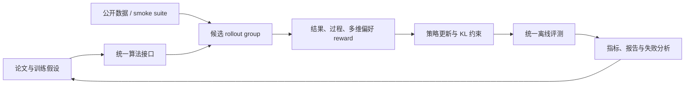

# LLM 后训练研究

这里是后训练论文的长期研究入口，覆盖偏好优化、在线强化学习、on-policy
distillation、过程奖励和数据闭环。它与[模型定向进化](../model-evolution.md)并列：
模型进化搜索结构与超参数，本模块研究如何构造训练信号并更新策略。

!!! info "复现保真度"
    当前公开实验使用候选策略完整执行采样、策略概率、优势估计、KL 约束、教师缓存
    和指标记录，属于**机制复现**。它不是论文中的 8B/30B 全参数训练，页面会分别列出
    论文结果和本地结果，二者不混作同一基线。

## 快速入口

- [方法索引](catalog.md)：按研究方向查看基线、已实现论文、原作者代码和本地入口。
- [统一评测协议](benchmark.md)：数据、指标、公平比较口径和新增方法验收标准。
- [Lightning OPD](2604.13010-lightning-opd/README.md)：离线缓存教师分布的 on-policy distillation。
- [GPRL](2605.18721-gprl/README.md)：多维偏好的 group-relative 强化学习。
- [TCR](2607.19824-tcr/README.md)：thinking checklist 与残差过程奖励。

## 研究闭环



## 当前实现

| 类别 | 方法 | 核心机制 | 公开评测 | 状态 |
|---|---|---|---|---|
| 通用基线 | DPO / GRPO | 成对偏好优化 / group-relative advantage | Arithmetic smoke、GSM8K candidate | 已实现 |
| 蒸馏 | [Lightning OPD](2604.13010-lightning-opd/README.md) | SFT rollout 上预计算教师分布，训练期零在线教师调用 | 同上 | 机制复现 |
| 多目标 RL | [GPRL](2605.18721-gprl/README.md) | 分维度 group normalization 与漂移控制 | 同上 | 机制复现 |
| 过程奖励 | [TCR](2607.19824-tcr/README.md) | thinking checklist、EMA 残差奖励 | 同上 | 机制复现 |

## 公开实验快照

固定 GSM8K candidate 512/128 train/validation examples、300 steps、seed 42。
指标是六候选 exact-answer 策略准确率，**不是自由生成 Pass@1**。

| 方法 | 训练前 accuracy | 训练后 accuracy | KL(reference) |
|---|---:|---:|---:|
| DPO | 0.1641 | 0.8047 | 0.0683 |
| GRPO | 0.1641 | 0.8047 | 1.1397 |
| Lightning OPD | 0.1641 | **0.8359** | 0.8269 |
| GPRL | 0.1641 | 0.3672 | 1.1022 |
| TCR | 0.1641 | **0.8359** | 0.5629 |

完整定义、smoke 结果和差异解释见[统一评测协议](benchmark.md)，稳定指标见
[`post-training-gsm8k-candidate-seed42.json`](../experiments/post-training-gsm8k-candidate-seed42.json)。

## 一键运行

```bash
auto-research post-train --algorithm lightning-opd \
  --dataset arithmetic-smoke --steps 100 --seed 42

auto-research post-train --algorithm gprl \
  --dataset gsm8k-candidate --maximum-examples 512 --steps 300
```

每次运行独立写入 `runs/post-training/<algorithm>-<dataset>-seed<seed>/`，
包含 `metrics.json` 和中文 `report.md`；checkpoint 只保存在本地，不提交 GitHub。

## 后续扩展约定

新增论文时必须同时完成算法实现、独立论文页、方法索引、统一协议实验和稳定指标。
论文页固定包含论文信息、背景与主要改动、架构图、核心公式、论文效果、本地映射、
复现实验和保真边界，避免入口页随着论文数量增长而失控。
