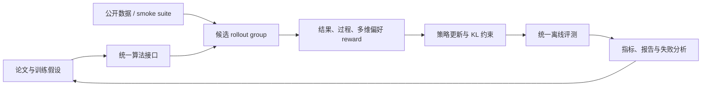

# LLM 后训练研究

这里是[论文实现与评测库](../research-library.md)中的纯 LLM 后训练分支，覆盖偏好优化、
在线强化学习、on-policy distillation、过程奖励和数据闭环。这里先建立可信算法组件
与公共评测；成熟组件可以继续接入[自动进化](../evolution-domains.md)，和网络结构、
预训练数据及超参数一起搜索。

!!! info "复现保真度"
    当前公开实验使用候选策略完整执行采样、策略概率、优势估计、KL 约束、教师缓存
    和指标记录，属于**机制复现**。它不是论文中的 8B/30B 全参数训练，页面会分别列出
    论文结果和本地结果，二者不混作同一基线。

## 快速入口

- [自动进化中的纯 LLM](../evolution-domains.md)：查看结构、数据和后训练的组合方式。
- [方法索引](catalog.md)：按研究方向查看基线、已实现论文、原作者代码和本地入口。
- [论文谱系与缺口](lineage.md)：系统审计已覆盖主干、P1 缺口和下一步评测前置条件。
- [统一评测协议](benchmark.md)：数据、指标、公平比较口径和新增方法验收标准。
- [DPO](2305.18290-dpo/README.md)：reference-relative 偏好分类，无 reward model。
- [KTO](2402.01306-kto/README.md)：只需单条 desirable/undesirable 标签的前景理论目标。
- [ORPO](2403.07691-orpo/README.md)：SFT 与 odds-ratio 偏好合一，无 reference model。
- [DeepSeekMath / GRPO](2402.03300-grpo/README.md)：组相对、critic-free 的 reasoning RL。
- [InstructGPT / PPO-RLHF](2203.02155-ppo-rlhf/README.md)：旧策略、critic、clip 与 KL 的经典 RLHF。
- [RLOO](2402.14740-rloo/README.md)：完整响应级 leave-one-out REINFORCE。
- [ReMax](2310.10505-remax/README.md)：以 greedy rollout 作 baseline 的 value-free RLHF。
- [DAPO](2503.14476-dapo/README.md)：Clip-Higher、动态采样、token loss 与过长惩罚。
- [GSPO](2507.18071-gspo/README.md)：长度归一化的 sequence-level importance ratio。
- [Lightning OPD](2604.13010-lightning-opd/README.md)：离线缓存教师分布的 on-policy distillation。
- [GPRL](2605.18721-gprl/README.md)：多维偏好的 group-relative 强化学习。
- [TCR](2607.19824-tcr/README.md)：thinking checklist 与残差过程奖励。

## 研究闭环



## 当前实现

| 类别 | 方法 | 核心机制 | 公开评测 | 状态 |
|---|---|---|---|---|
| 直接偏好优化 | [DPO](2305.18290-dpo/README.md) | reference-relative pairwise classification | GSM8K candidate | 机制复现 |
| 二元反馈对齐 | [KTO](2402.01306-kto/README.md) | prospect utility、desirable/undesirable、KL 参照点 | GSM8K candidate | 机制复现 |
| 单阶段偏好 | [ORPO](2403.07691-orpo/README.md) | SFT NLL + odds-ratio penalty，无 reference | GSM8K candidate | 机制复现 |
| 在线推理 RL | [GRPO](2402.03300-grpo/README.md) | group advantage、old-policy clip、KL，无 critic | GSM8K candidate | 机制复现 |
| 经典在线 RL | [PPO-RLHF](2203.02155-ppo-rlhf/README.md) | old policy、clipped surrogate、critic、KL | GSM8K candidate | 机制复现 |
| 经典在线 RL | [RLOO](2402.14740-rloo/README.md) | response-level REINFORCE、leave-one-out baseline | GSM8K candidate | 机制复现 |
| 经典在线 RL | [ReMax](2310.10505-remax/README.md) | sampled reward 减 greedy reward，无 critic | GSM8K candidate | 机制复现 |
| 长推理 RL | [DAPO](2503.14476-dapo/README.md) | 非对称 clip、动态采样、token loss、overlong shaping | GSM8K candidate | 机制复现 |
| 稳定序列 RL | [GSPO](2507.18071-gspo/README.md) | sequence ratio、group advantage、序列级 clip | GSM8K candidate | 机制复现 |
| 蒸馏 | [Lightning OPD](2604.13010-lightning-opd/README.md) | SFT rollout 上预计算教师分布，训练期零在线教师调用 | 同上 | 机制复现 |
| 多目标 RL | [GPRL](2605.18721-gprl/README.md) | 分维度 group normalization 与漂移控制 | 同上 | 机制复现 |
| 过程奖励 | [TCR](2607.19824-tcr/README.md) | thinking checklist、EMA 残差奖励 | 同上 | 机制复现 |

## 公开实验快照

固定 GSM8K candidate 512/128 train/validation examples、300 steps、seed 42。
指标是六候选 exact-answer 策略准确率，**不是自由生成 Pass@1**。

| 方法 | 训练前 accuracy | 训练后 accuracy | KL(reference) |
|---|---:|---:|---:|
| DPO | 0.1641 | 0.8047 | 0.0683 |
| KTO | 0.1641 | 0.8359 | 0.0143 |
| ORPO | 0.1641 | **0.8438** | 0.8973 |
| GRPO | 0.1641 | 0.7812 | 1.0401 |
| DAPO | 0.1641 | 0.7578 | 1.0870 |
| GSPO | 0.1641 | 0.8281 | 0.7017 |
| PPO-RLHF | 0.1641 | 0.8125 | 0.8731 |
| RLOO | 0.1641 | 0.8281 | 0.5707 |
| ReMax | 0.1641 | 0.7031 | 0.7939 |
| Lightning OPD | 0.1641 | **0.8359** | 0.8269 |
| GPRL | 0.1641 | 0.3672 | 1.1022 |
| TCR | 0.1641 | **0.8359** | 0.5629 |

完整定义、smoke 结果和差异解释见[统一评测协议](benchmark.md)，稳定指标见
[`post-training-gsm8k-candidate-seed42.json`](../experiments/post-training-gsm8k-candidate-seed42.json)。
经典 RL 稳定指标见
[`classic-post-training-gsm8k-seed42.json`](../experiments/classic-post-training-gsm8k-seed42.json)。

## 一键运行

```bash
auto-research post-train --algorithm lightning-opd \
  --dataset arithmetic-smoke --steps 100 --seed 42

auto-research post-train --algorithm gprl \
  --dataset gsm8k-candidate --maximum-examples 512 --steps 300

auto-research post-train --algorithm rloo \
  --dataset gsm8k-candidate --maximum-examples 512 --steps 300 --offline

auto-research post-train --algorithm dapo \
  --dataset gsm8k-candidate --maximum-examples 512 --steps 300 --offline
```

每次运行独立写入 `runs/post-training/<algorithm>-<dataset>-seed<seed>/`，
包含 `metrics.json` 和中文 `report.md`；checkpoint 只保存在本地，不提交 GitHub。

## 后续扩展约定

新增论文时必须同时完成算法实现、独立论文页、方法索引、统一协议实验和稳定指标。
论文页固定包含论文信息、背景与主要改动、架构图、核心公式、论文效果、本地映射、
复现实验和保真边界，避免入口页随着论文数量增长而失控。
