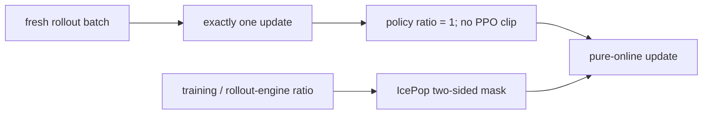

# Online IcePop：单次 rollout 更新的纯在线失配掩码

> 本页在公开候选策略上复现网页资料中的可隔离 RL 更新机制；不把轻量实验写成来源材料中的大模型效果。

## 资料信息

| 字段 | 内容 |
|---|---|
| 资料链接 | [Online IcePop 技术说明](https://zhuanlan.zhihu.com/p/1984379979035850499) |
| 公司 / 机构 | Ant Group Bailing Team |
| 首次公开日期 | 2025-12-16（作者公开说明页首发） |
| 原作者代码 | 未发布独立源代码；属于 IcePop 的训练调度变体 |
| 本地 adapter / 算法键 | `online-icepop` |
| 本地复现代码 | [`src/auto_research/post_training/`](https://github.com/daiwk/auto-research/tree/main/src/auto_research/post_training/) |

## 原始资料总结

### 背景与主要改动

普通 IcePop 同时面对训练/rollout 引擎差异和一次 rollout 被多次更新造成的策略陈旧。Online IcePop 强制每个 rollout batch 只更新一次，使 stale-policy ratio 恒为 1，从目标中移除 PPO ratio 与 clip；训练侧仍用 IcePop 双侧 mask 和区间内原始 ratio 校正引擎失配。



### 核心公式

$$
r_t^{\rm policy}=1,\qquad \mathcal L_{\rm online}=-\mathbb E\!\left[\mathbf1[c_{\rm low}\le\rho_t^{\rm TI}\le c_{\rm high}]\,\rho_t^{\rm TI}A_t\right].
$$

### 资料离线与线上效果

原始说明聚焦稳定性设计，主张以 pure-online 单次更新消除 router shift 累积；该资料不是独立论文，没有独立 benchmark 表或生产线上 A/B。

## 本地复现

每个训练 step 后立即把当前权重刷新为下一批 rollout 权重，诊断中强制 `policy_staleness_ratio_mean=1`、关闭 PPO clip，同时沿用 IcePop `[0.5, 5.0]` 双侧 mask。

```bash
auto-research post-train --algorithm online-icepop --dataset gsm8k-candidate --maximum-examples 256 --steps 120 --seed 42
```

固定 seed 汇总指标见 [`rl-papers-summary-seed42.json`](../../experiments/rl-papers-summary-seed42.json)。

## 复现边界

本地一个 candidate group 对应一个 rollout batch，不包含真实并行采样和通信；验证的是单次更新调度、stale ratio 消除和训推 mask 的组合语义。
