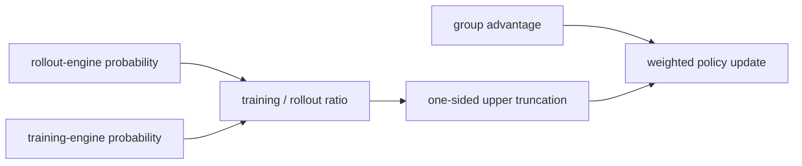

# TIS：截断重要性采样训推校正

> 本页在公开候选策略上复现网页资料中的可隔离 RL 更新机制；不把轻量实验写成来源材料中的大模型效果。

## 资料信息

| 字段 | 内容 |
|---|---|
| 资料链接 | [Your Efficient RL Framework Secretly Brings You Off-Policy RL Training](https://fengyao.notion.site/off-policy-rl) |
| 公司 / 机构 | UC San Diego / Microsoft Research |
| 首次公开日期 | 2025-08-05 |
| 原作者代码 | 未发布独立算法仓库；资料页列出 OAT、SkyRL、OpenRLHF 后续实现 |
| 本地 adapter / 算法键 | `tis` |
| 本地复现代码 | [`src/auto_research/post_training/`](https://github.com/daiwk/auto-research/tree/main/src/auto_research/post_training/) |

## 原始资料总结

### 背景与主要改动

混合训练框架由 rollout 引擎采样、训练引擎重算 log-prob；即使权重相同，数值精度和 kernel 差异也会让行为分布与训练分布偏离。TIS 将训练侧与 rollout 引擎概率比乘入策略梯度，并只对过大的校正权重做单侧上截断，保留小权重样本而控制重尾方差。



### 核心公式

$$
\rho_t^{\rm TI}=\frac{\pi_{\rm train}(a_t\mid s_t)}{\pi_{\rm rollout}(a_t\mid s_t)},\qquad w_t=\min(\rho_t^{\rm TI},c),\qquad \mathcal L=-\mathbb E[w_t r_t^{\rm policy}A_t].
$$

### 资料离线与线上效果

原始网页在多个 LLM RL 设置中比较 Vanilla IS、PPO-IS 与 TIS，报告截断校正能避免训推概率差异引发的训练崩溃；该资料不是独立论文，也未报告生产线上 A/B。

## 本地复现

本地显式维护旧训练策略和带确定性数值/router 扰动的 rollout 引擎分布，以 `c=2` 单侧截断训推 ratio；TIS 不丢弃区间外样本，并继续保留 PPO stale-policy ratio。

```bash
auto-research post-train --algorithm tis --dataset gsm8k-candidate --maximum-examples 256 --steps 120 --seed 42
```

固定 seed 汇总指标见 [`rl-papers-summary-seed42.json`](../../experiments/rl-papers-summary-seed42.json)。

## 复现边界

候选动作分布替代逐 token LLM 概率，确定性引擎扰动替代真实 vLLM/FSDP 数值差异；这里只验证 TIS 权重与梯度路径，不复刻网页中的大模型训练。
