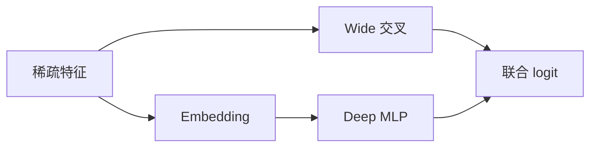
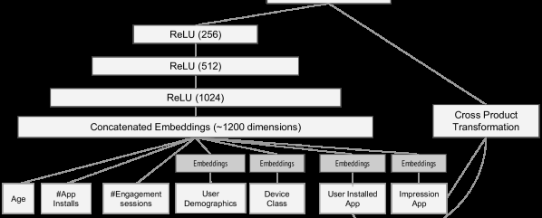

# Wide & Deep

> **Fidelity: 核心机制复现**。本地实现联合记忆型 wide 交叉与泛化型 deep tower。

## 论文信息

| 项目 | 内容 |
| --- | --- |
| 论文链接 | [arXiv 1606.07792](https://arxiv.org/abs/1606.07792) |
| 公司/机构 | Google |
| 首次公开日期 | 2016-06-24（arXiv v1） |
| 原文开源代码 | 是：[官方/作者代码](https://github.com/tensorflow/models/tree/master/official/r1/wide_deep) |
| Adapter | `wide-deep` |
| 本地复现代码 | [`src/auto_research/reproductions/wide_deep/`](https://github.com/daiwk/auto-research/tree/main/src/auto_research/reproductions/wide_deep/) |

## 原始论文总结

### 背景与主要改动

纯线性模型善于记忆稀疏共现但泛化弱，纯 DNN 能泛化却可能推荐不相关组合。论文联合训练两路并共享最终 logit。



<!-- paper-figure:start -->
### 原论文关键图

[](https://ar5iv.labs.arxiv.org/html/1606.07792/assets/x4.png)

> **原论文 Figure 4（关键图）**：展示原论文提出的核心架构、主要模块及其连接关系。图片来自[原论文](https://arxiv.org/abs/1606.07792)，版权归原作者所有；点击图片可查看来源。
<!-- paper-figure:end -->

### 核心公式

$$
p(y=1\mid x)=\sigma(w_{\rm wide}^{\top}[x,\phi(x)]+w_{\rm deep}^{\top}h_L+b).
$$

### 论文离线与线上效果

Google Play 三周线上实验中，Wide & Deep 相对 wide control 的应用获取量提升 **3.9%**，并相对 deep model 再提升约 **1%**。

## 本地复现

> **本地对照口径**：基线是参数匹配的 deep-only 模型；实验组加入 candidate 与 genre 交叉的 wide 路径；MovieLens-100K 三 seed 全库 NDCG@10 相对 **+5.45%**。

```bash
auto-research reproduce --paper wide-deep
```

结构化结果见 [`metrics/movielens-100k-seeds42-44.json`](metrics/movielens-100k-seeds42-44.json)。

## 复现边界

公开 MovieLens 替代 Google Play 私有日志；未复刻生产特征工程、分布式训练与 serving。
