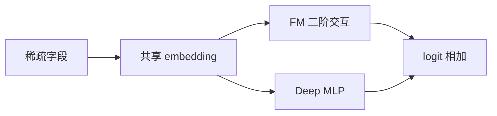
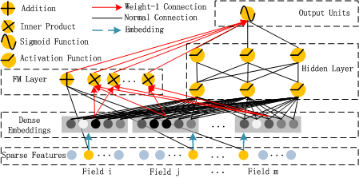

# DeepFM：FM 与深层网络共享 embedding

> 复现级别：**核心机制复现**。实际联合训练 FM 二阶交互与 deep 分支；私有工业特征和线上系统不在本地复现范围。

## 论文信息

| 项目 | 内容 |
| --- | --- |
| 论文链接 | [arXiv 1703.04247](https://arxiv.org/abs/1703.04247) |
| 公司/机构 | Huawei Noah's Ark Lab |
| 首次公开日期 | 2017-03-13（arXiv v1） |
| 原文开源代码 | 否：论文未提供官方/作者代码（核查日期：2026-07-28） |
| Adapter | `deepfm` |
| 本地复现代码 | [`src/auto_research/reproductions/deepfm/`](https://github.com/daiwk/auto-research/tree/main/src/auto_research/reproductions/deepfm/) |

## 原始论文总结

### 背景与主要改动

CTR 排序既依赖低阶组合特征，也依赖高阶非线性交互。传统 Wide & Deep 需要人工构造 wide 特征，DeepFM 则让两条路径端到端共享 embedding。

模型把 FM 的一阶/二阶项与 MLP 输出相加。相同 field embedding 同时进入两条路径，减少人工交叉和重复参数。

<!-- paper-figure:start -->
### 原论文关键图

> **原论文 Figure 1（关键图）**：展示原论文提出的核心架构、主要模块及其连接关系。图片来自[原论文](https://arxiv.org/abs/1703.04247)，版权归原作者所有；点击图片可查看来源。
<!-- paper-figure:end -->

### 核心公式

$$
\hat y=\sigma\left(w_0+\sum_i w_i x_i+
\sum_{i<j}\langle v_i,v_j\rangle x_ix_j+y_{\mathrm{DNN}}\right).
$$

### 论文离线与线上效果

原文在 Criteo 和企业数据上比较 AUC/logloss，并报告优于 FM 与纯深度模型；本条按用户批准作为经典例外，不将其证据用于放宽新工业论文线上门槛。

## 本地复现

> **本地对照口径**：基线为 embedding MLP，实验组为共享 embedding 的 FM + deep 分支；NDCG@10 相对 **+23.58%**，见 `metrics/movielens-100k-seeds42-44.json`。

- 数据：完整下载的 MovieLens-100K，本地训练使用固定紧凑子集。
- 公平基线：共享相同 embedding、训练步数和负采样的 embedding MLP。
- 方法：真实 FM 二阶项加 deep 分支，不用手工分数代理。
- 运行：`auto-research reproduce --paper deepfm --dataset-dir data`

三 seed 下 NDCG@10 为 `0.02743→0.03390`，Hit@10 为 `0.05556→0.06667`。结果写入独立的 JSON 与 Markdown artifact；checkpoint 不提交。
