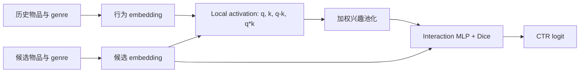

# DIN：Deep Interest Network

> 保真度：**核心机制复现**。本实现实际训练候选物品条件化的 local activation、加权兴趣池化、Dice 与 CTR 网络；未复刻 Alibaba 私有稀疏特征、mini-batch-aware regularization 和生产 serving。

论文：[arXiv 1706.06978](https://arxiv.org/abs/1706.06978) · [作者代码](https://github.com/zhougr1993/DeepInterestNetwork)

## 原始论文总结

### 背景与主要改动

传统 CTR 模型把用户全部行为压成固定向量，但用户与候选物品相关的兴趣只占历史的一部分。DIN 不再生成一个与候选无关的用户向量，而是用候选物品逐条激活历史行为，再把局部兴趣送入点击网络；Dice 根据当前特征分布自适应调整激活边界。



### 核心公式

对候选向量 \(q\) 和第 \(i\) 个行为 \(e_i\)，local activation 学习权重：

\[
a_i=g(q,e_i,q-e_i,q\odot e_i),\qquad
v_U(q)=\sum_i \operatorname{softmax}(a)_i e_i.
\]

Dice 用批次统计得到 \(p(s)=\sigma(\mathrm{BN}(s))\)，并计算
\(\mathrm{Dice}(s)=p(s)s+(1-p(s))\alpha s\)。本地候选点击使用正负样本 BCE 训练。

### 论文离线与线上效果

- 离线：论文在 MovieLens-20M 报告 DIN AUC 0.7337、DIN+Dice 0.7348；Amazon 为 0.8818、0.8871。
- 在线：Alibaba 2017-05 至 2017-06 的生产 A/B 中，CTR +10.0%，RPM +3.8%。

论文数值使用其数据、特征与协议，不能与下表直接横比。

## 本地复现

MovieLens-100K 自动下载到本地；932 个有效用户、1,682 个物品，按用户时间顺序 leave-two-out，并对完整物品库排名。DIN 与 mean-pool 对照使用相同 embedding、MLP、参数量和训练预算；种子 42/43/44，每个 320 step，Apple MPS。

| Model | Hit@10 | NDCG@10 | Head share@10 |
|---|---:|---:|---:|
| Mean pool | 0.03720 ± 0.00220 | 0.01783 ± 0.00188 | 0.99871 |
| DIN | 0.03577 ± 0.00220 | 0.01659 ± 0.00152 | 0.99950 |

DIN 相对 mean pool 的 NDCG@10 为 **-6.97%**。训练 loss 正常下降，但两个模型几乎都退化到头部物品；这个小型、仅 genre 内容的公开替代数据没有验证论文收益。它说明核心机制能运行，不是否定论文在大规模多域稀疏特征上的结果。

审计指标见 [metrics/movielens-100k-seeds42-44.json](metrics/movielens-100k-seeds42-44.json)。

## 复现命令

```bash
AUTO_RESEARCH_DIN_STEPS=320 auto-research reproduce --paper din --seed 42
```
