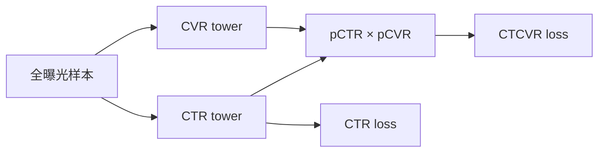

# ESMM：完整空间的点击—转化联合建模

> 复现级别：**核心机制复现**。实际执行 CTR/CVR 双塔、概率乘积与 entire-space loss；淘宝私有漏斗数据由公开数据构造替代。

## 论文信息

| 项目 | 内容 |
| --- | --- |
| 论文链接 | [arXiv 1804.07931](https://arxiv.org/abs/1804.07931) |
| 公司/机构 | Alibaba |
| 首次公开日期 | 2018-04-21（arXiv v1） |
| 原文开源代码 | 否：论文未提供官方/作者代码（核查日期：2026-07-28） |
| Adapter | `esmm` |
| 本地复现代码 | [`src/auto_research/reproductions/esmm/`](https://github.com/daiwk/auto-research/tree/main/src/auto_research/reproductions/esmm/) |

## 原始论文总结

### 背景与主要改动

CVR 只在点击样本上可观测，直接训练会遭遇 sample-selection bias；转化又远比点击稀疏。

ESMM 在全曝光空间同时学习 CTR 与 CVR，并用概率链式分解得到 CTCVR。CTR 的稠密监督帮助 CVR tower 学到更稳定的表示。

### 核心公式

$$
p(\mathrm{click\&conversion}\mid x)
=p(\mathrm{click}\mid x)\,p(\mathrm{conversion}\mid \mathrm{click},x).
$$

### 论文离线与线上效果

论文在 Ali-CCP 样本和工业日志上报告 AUC/校准收益；本条按用户批准作为经典例外。

## 本地复现

> **本地对照口径**：基线只在 clicked space 训练 CVR，实验组在 entire space 联合 CTR 与 CTCVR；平均任务 AUC 相对 **+1.69%**，见 `metrics/movielens-100k-seeds42-44.json`。

- 数据：MovieLens-100K；rating ≥3 构造 click，rating ≥4 构造 conversion，并加入全空间负样本。
- 基线：只在 clicked space 训练 CVR tower。
- 方法：完整空间联合训练 CTR 与乘积后的 CTCVR。
- 运行：`auto-research reproduce --paper esmm --dataset-dir data`

三 seed 下 conversion AUC 为 `0.55590→0.56697`（`+1.99%`），平均任务 AUC 为 `0.55928→0.56872`。
