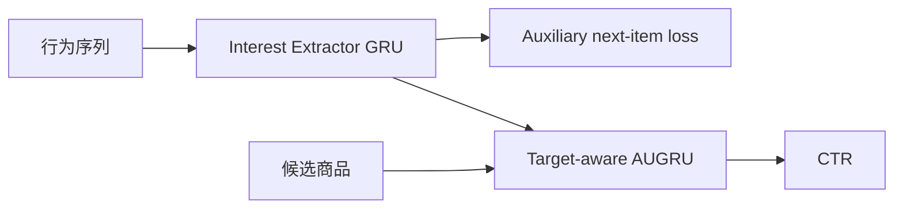

# DIEN

> **Fidelity: 核心机制复现**。实现兴趣抽取 GRU、下一行为辅助损失和候选相关兴趣演化。

## 论文信息

| 项目 | 内容 |
| --- | --- |
| 论文链接 | [arXiv 1809.03672](https://arxiv.org/abs/1809.03672) |
| 公司/机构 | Alibaba |
| 首次公开日期 | 2018-09-11（arXiv v1） |
| 原文开源代码 | 是：[mouna99/dien](https://github.com/mouna99/dien) |
| Adapter | `dien` |
| 本地复现代码 | [`src/auto_research/reproductions/dien/`](https://github.com/daiwk/auto-research/tree/main/src/auto_research/reproductions/dien/) |

## 原始论文总结

### 背景与主要改动

DIN 直接激活历史兴趣，DIEN 则先用辅助监督抽取逐步兴趣，再让目标商品控制兴趣状态的演化速度。



### 核心公式

$$
L=L_{\rm ctr}+\alpha L_{\rm aux},\qquad
\tilde u_t=a_tu_t,\quad h_t=(1-\tilde u_t)h_{t-1}+\tilde u_t\tilde h_t.
$$

### 论文离线与线上效果

Taobao 展示广告线上实验报告 CTR **+20.7%**、eCPM **+17.1%**、PPC **-3.0%**。

## 本地复现

> **本地对照口径**：基线是同一训练协议的 DIN；实验组加入 GRU、辅助目标和候选相关演化；三 seed NDCG@10 相对 **-1.98%**，未迁移论文收益。

```bash
auto-research reproduce --paper dien
```

结构化结果见 [`metrics/movielens-100k-seeds42-44.json`](metrics/movielens-100k-seeds42-44.json)。

## 复现边界

MovieLens 的短序列和稀疏信号不能替代 Taobao 广告特征；未使用生产 fused AUGRU kernel。
