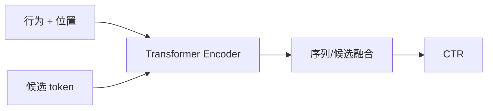
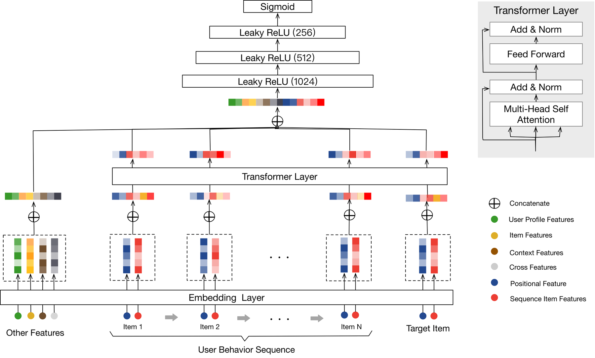

# BST

> **Fidelity: 核心机制复现**。实现候选 token、位置编码和行为序列 Transformer。

## 论文信息

| 项目 | 内容 |
| --- | --- |
| 论文链接 | [arXiv 1905.06874](https://arxiv.org/abs/1905.06874) |
| 公司/机构 | Alibaba |
| 首次公开日期 | 2019-05-15（arXiv v1） |
| 原文开源代码 | 否：论文未提供官方/作者代码（核查日期：2026-08-09） |
| Adapter | `bst` |
| 本地复现代码 | [`src/auto_research/reproductions/bst/`](https://github.com/daiwk/auto-research/tree/main/src/auto_research/reproductions/bst/) |

## 原始论文总结

### 背景与主要改动

BST 用自注意力统一建模行为之间及行为与候选之间的关系，替代固定 pooling 或单一目标注意力。



<!-- paper-figure:start -->
### 原论文关键图

[](https://ar5iv.labs.arxiv.org/html/1905.06874/assets/figures/architecture.png)

> **原论文 Figure 1（关键图）**：展示原论文提出的核心架构、主要模块及其连接关系。图片来自[原论文](https://arxiv.org/abs/1905.06874)，版权归原作者所有；点击图片可查看来源。
<!-- paper-figure:end -->

### 核心公式

$$
H'=\operatorname{softmax}\!\left(\frac{QK^\top}{\sqrt d}\right)V,\qquad
\hat y=\sigma(\operatorname{MLP}([h_{\rm cand},\operatorname{pool}(H')])).
$$

### 论文离线与线上效果

淘宝推荐线上 A/B 中，BST 相对 WDL 的 CTR 提升 **7.57%**。

## 本地复现

> **本地对照口径**：基线是 DIN；实验组是候选参与编码的 Transformer；三 seed NDCG@10 相对 **+20.29%**。

```bash
auto-research reproduce --paper bst
```

结构化结果见 [`metrics/movielens-100k-seeds42-44.json`](metrics/movielens-100k-seeds42-44.json)。

## 复现边界

公开数据替代淘宝日志；没有复刻用户画像、上下文特征和生产推理系统。
