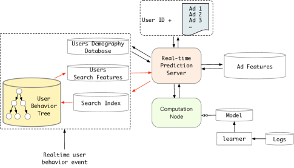

# Search-based User Interest Modeling with Lifelong Sequential Behavior Data for CTR Prediction

> **保真度：核心机制复现**。原文结论、本地公开数据实验和未复刻部分分开陈述。

## 论文信息

| 字段 | 内容 |
|---|---|
| 论文链接 | [CIKM 2020](https://arxiv.org/abs/2006.05639) |
| 公司/机构 | Alibaba |
| 首次公开日期 | 2020-06-10（arXiv v1） |
| 原文开源代码 | 否：未发现/未发布原作者官方代码仓库（核查日期：2026-08-08） |
| Adapter | `sim` |
| 本地复现代码 | [`src/auto_research/reproductions/sim/`](https://github.com/daiwk/auto-research/tree/main/src/auto_research/reproductions/sim/) |

## 原始论文总结

### 背景与主要改动

以候选 item 为 query，GSU 从终身行为中快速搜索相关子序列，ESU 再计算候选与子序列的精确注意力。


<!-- paper-figure:start -->
### 原论文关键图

[](https://ar5iv.labs.arxiv.org/html/2006.05639/assets/x3.png)

> **原论文 Figure 3（关键图）**：展示原论文方法的总体设计和关键组成。图片来自[原论文](https://arxiv.org/abs/2006.05639)，版权归原作者所有；点击图片可查看来源。
<!-- paper-figure:end -->

### 核心公式

$$
S=\operatorname{TopK}_{i\in H}s_{GSU}(q,i),\quad h_q=\sum_{i\in S}\operatorname{softmax}(q^\top k_i)v_i.
$$

### 论文离线与线上效果

Alibaba 展示广告主流量：CTR +7.1%，RPM +4.4%，最长历史 54,000。

## 本地复现

> **本地对照口径**：基线为 `shared transition + content baseline`，实验组为 `SIM`，只改变论文核心机制；`ndcg_at_10` 0.0354 → **0.0471，相对基线 +32.97%**。

```bash
auto-research reproduce --paper sim --dataset-dir data --seed 42
```

固定指标见 [`metrics/public-seed42.json`](metrics/public-seed42.json)。

## 复现边界

在 MovieLens-100K 全库排序上执行论文的候选相关检索、层级压缩或蒸馏目标；未使用公司私有日志与线上 serving，线上 A/B 只引用原文。 本地相对变化不得与原文指标混写。
