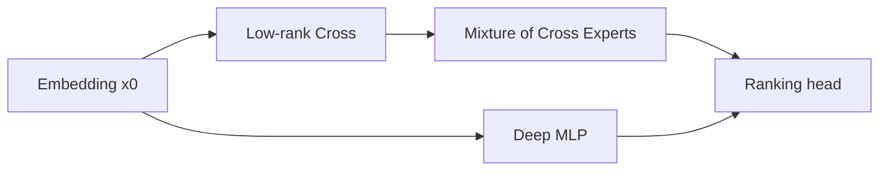
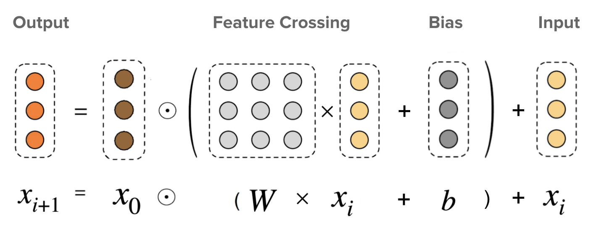

# DCN-V2

> **Fidelity: 核心机制复现**。实现低秩 cross experts、输入相关 gate 与 deep tower。

## 论文信息

| 项目 | 内容 |
| --- | --- |
| 论文链接 | [arXiv 2008.13535](https://arxiv.org/abs/2008.13535) |
| 公司/机构 | Google |
| 首次公开日期 | 2020-08-19（arXiv v1） |
| 原文开源代码 | 否：论文未提供官方/作者代码（核查日期：2026-07-28） |
| Adapter | `dcn-v2` |
| 本地复现代码 | [`src/auto_research/reproductions/dcn_v2/`](https://github.com/daiwk/auto-research/tree/main/src/auto_research/reproductions/dcn_v2/) |

## 原始论文总结

### 背景与主要改动

DCN-V2 显式构造有界阶数的特征交互，并用低秩矩阵与专家混合降低 web-scale ranking 的参数和计算成本。



<!-- paper-figure:start -->
### 原论文关键图

[](https://ar5iv.labs.arxiv.org/html/2008.13535/assets/dcn-formula.png)

> **原论文 Figure 2（关键图）**：展示原论文方法的总体设计和关键组成。图片来自[原论文](https://arxiv.org/abs/2008.13535)，版权归原作者所有；点击图片可查看来源。
<!-- paper-figure:end -->

### 核心公式

$$
x_{l+1}=x_0\odot(W_lx_l+b_l)+x_l,\qquad
W_l=\sum_e g_e(x_l)U_eV_e^\top.
$$

### 论文离线与线上效果

论文在 Criteo、MovieLens 与 Google 私有排序数据上优于 DNN/DCN，并报告生产业务指标显著改善，但没有披露精确线上 lift。本文作为用户明确要求的经典架构例外收录，不计入“量化 A/B”集合。

## 本地复现

> **本地对照口径**：基线是 deep-only；实验组是两层低秩 cross experts 与 gate；三 seed NDCG@10 相对 **+22.87%**。

```bash
auto-research reproduce --paper dcn-v2
```

结构化结果见 [`metrics/movielens-100k-seeds42-44.json`](metrics/movielens-100k-seeds42-44.json)。

## 复现边界

未使用 Google 私有数据和生产级专家规模；结果只验证显式交叉在公开数据上的作用。
