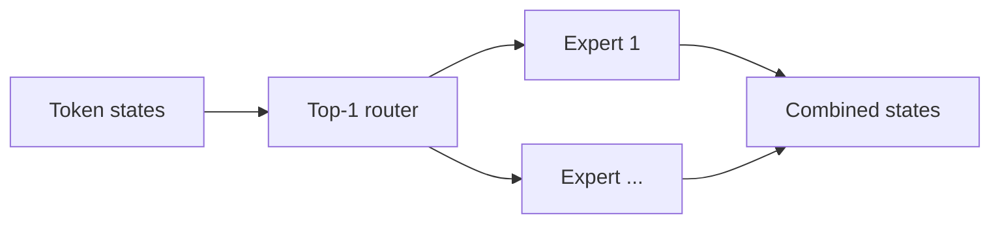

# Switch Transformer

> **Fidelity: 核心机制复现**。实现 token-level top-1 expert routing 与负载均衡辅助损失。

## 论文信息

| 项目 | 内容 |
| --- | --- |
| 论文链接 | [arXiv 2101.03961](https://arxiv.org/abs/2101.03961) |
| 公司/机构 | Google Brain |
| 首次公开日期 | 2021-01-11（arXiv v1） |
| 原文开源代码 | 是：[TensorFlow Mesh](https://github.com/tensorflow/mesh) |
| Adapter | `switch-transformer` |
| 本地复现代码 | [`src/auto_research/reproductions/switch_transformer/`](https://github.com/daiwk/auto-research/tree/main/src/auto_research/reproductions/switch_transformer/) |

## 原始论文总结

### 背景与主要改动

Switch 把 dense FFN 替换为每个 token 只激活一个专家的稀疏 MoE，在近似固定 FLOPs 下扩大参数容量。



### 核心公式

$$
e(x)=\arg\max_i p_i(x),\quad y=p_{e(x)}(x)E_{e(x)}(x),\quad
L_{\rm aux}=N\sum_i f_i\bar p_i.
$$

### 论文离线与线上效果

论文报告相对 T5-Base 达到约 **7×** 预训练速度提升，并训练到 **1.6T** 参数；无线上 A/B。

## 本地复现

> **本地对照口径**：基线是参数预算内 dense Transformer；实验组是四专家 top-1 Switch FFN；WikiText-2 30-step perplexity 相对 **-3.29%**（越低越好）。

```bash
auto-research reproduce --paper switch-transformer
```

结构化结果见 [`metrics/wikitext2-seed42.json`](metrics/wikitext2-seed42.json)。

## 复现边界

未复刻万亿参数训练、expert capacity overflow 和跨设备 all-to-all。
