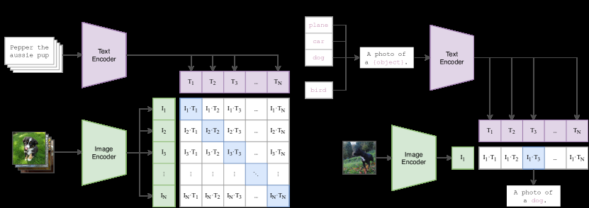

# Learning Transferable Visual Models From Natural Language Supervision

> **保真度：核心机制复现**。原文结论、本地公开数据实验和未复刻部分分开陈述。

## 论文信息

| 字段 | 内容 |
|---|---|
| 论文链接 | [arXiv 2103.00020](https://arxiv.org/abs/2103.00020) |
| 公司/机构 | OpenAI |
| 首次公开日期 | 2021-02-26（arXiv v1） |
| 原文开源代码 | 是：[原作者仓库](https://github.com/openai/CLIP) |
| Adapter | `clip` |
| 本地复现代码 | [`src/auto_research/reproductions/clip/`](https://github.com/daiwk/auto-research/tree/main/src/auto_research/reproductions/clip/) |

## 原始论文总结

### 背景与主要改动

用独立图像/文本 encoder 将配对样本映射到同一单位球面，通过双向 batch contrastive objective 学习可迁移零样本表示。


<!-- paper-figure:start -->
### 原论文关键图

[](https://ar5iv.labs.arxiv.org/html/2103.00020/assets/x1.png)

> **原论文 Figure 1（关键图）**：展示原论文的训练流程与关键优化环节。图片来自[原论文](https://arxiv.org/abs/2103.00020)，版权归原作者所有；点击图片可查看来源。
<!-- paper-figure:end -->

### 核心公式

$$
\mathcal L=\tfrac12\operatorname{CE}(I T^\top/\tau,y)+\tfrac12\operatorname{CE}(T I^\top/\tau,y).
$$

### 论文离线与线上效果

4 亿图文对预训练；ImageNet zero-shot 达到原始监督 ResNet-50 水平，并评测 30 多个数据集。

## 本地复现

> **本地对照口径**：基线为 `random cross-modal retrieval`，实验组为 `symmetric contrastive image-text encoder`，只改变论文核心机制；`recall_at_1` 0.0125 → **0.4125，相对基线 +3200.00%**。

```bash
auto-research reproduce --paper clip --dataset-dir data --seed 42
```

固定指标见 [`metrics/public-seed42.json`](metrics/public-seed42.json)。

## 复现边界

用 MovieLens 公开 item 的两种观测视图执行双塔、归一化和双向 InfoNCE；没有复刻 4 亿图文对。 本地相对变化不得与原文指标混写。
