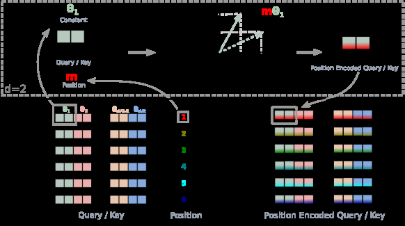

# RoFormer: Enhanced Transformer with Rotary Position Embedding

> **保真度：核心机制复现**。原文结论、本地公开数据实验和未复刻部分分开陈述。

## 论文信息

| 项目 | 内容 |
| --- | --- |
| 论文链接 | [arXiv 2104.09864](https://arxiv.org/abs/2104.09864) |
| 公司/机构 | Zhuiyi Technology |
| 首次公开日期 | 2021-04-20（arXiv v1） |
| 原文开源代码 | 是：[官方/作者代码](https://github.com/ZhuiyiTechnology/roformer) |
| Adapter | `rope` |
| 本地复现代码 | [`src/auto_research/reproductions/rope/`](https://github.com/daiwk/auto-research/tree/main/src/auto_research/reproductions/rope/) |

## 原始论文总结

### 背景与主要改动

对每个 attention head 的 Q/K 二维子空间施加随位置旋转，使点积天然只依赖相对位移。


<!-- paper-figure:start -->
### 原论文关键图

[](https://ar5iv.labs.arxiv.org/html/2104.09864/assets/x1.png)

> **原论文 Figure 1（关键图）**：展示原论文方法的总体设计和关键组成。图片来自[原论文](https://arxiv.org/abs/2104.09864)，版权归原作者所有；点击图片可查看来源。
<!-- paper-figure:end -->

### 核心公式

$$
q_m=R_mW_qx_m,\ k_n=R_nW_kx_n,\quad q_m^\top k_n=x_m^\top W_q^\top R_{n-m}W_kx_n.
$$

### 论文离线与线上效果

原文在多项长文本分类与语言建模任务上优于绝对位置编码。

## 本地复现

> **本地对照口径**：基线为同预算 `llama_modern`，实验组为 `rope`；相对 PPL +0.00%。

WikiText-2、12 steps、64d/2-layer、seed 42：PPL 421.18 → **421.18（+0.00%）**；参数、token、优化器和步数相同。

```bash
auto-research reproduce --paper rope --dataset-dir data --seed 42
auto-research evolve --model micro-llm --dataset wikitext-2 --direction "组合 rope 与已安装论文算子" --generations 2 --population 4
```

固定指标见 [`metrics/public-seed42.json`](metrics/public-seed42.json)。

## 复现边界

实际对每个注意力 head 的 Q/K 执行复数平面旋转并由相对相位进入 dot product；WikiText-2 64d 小模型替代论文中文 RoFormer 预训练。 本地数值不等同于原论文大模型、私有数据、生产流量或专用 kernel；本地相对变化不得与原文提升混写。
