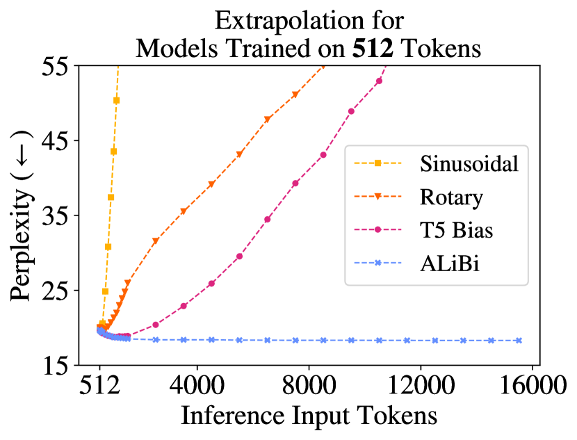

# Train Short, Test Long: Attention with Linear Biases Enables Input Length Extrapolation

> **保真度：核心机制复现**。原文结论、本地公开数据实验和未复刻部分分开陈述。

## 论文信息

| 字段 | 内容 |
|---|---|
| 论文链接 | [arXiv 2108.12409](https://arxiv.org/abs/2108.12409) |
| 公司/机构 | University of Washington / Meta AI |
| 首次公开日期 | 2021-08-27（arXiv v1） |
| 原文开源代码 | 是：[原作者仓库](https://github.com/ofirpress/attention_with_linear_biases) |
| Adapter | `alibi` |
| 本地复现代码 | [`src/auto_research/reproductions/alibi/`](https://github.com/daiwk/auto-research/tree/main/src/auto_research/reproductions/alibi/) |

## 原始论文总结

### 背景与主要改动

不学习位置向量，而是在每个 head 的注意力 logits 上加入线性距离惩罚，实现 train-short/test-long 外推。


<!-- paper-figure:start -->
### 原论文关键图

[](https://ar5iv.labs.arxiv.org/html/2108.12409/assets/x1.png)

> **原论文 Figure 1（关键图）**：展示原论文方法的总体设计和关键组成。图片来自[原论文](https://arxiv.org/abs/2108.12409)，版权归原作者所有；点击图片可查看来源。
<!-- paper-figure:end -->

### 核心公式

$$
\operatorname{softmax}(QK^\top-m_h|i-j|).
$$

### 论文离线与线上效果

原文在 1024 token 训练、2048 token 测试时匹配或超过正弦/旋转位置基线。

## 本地复现

> **本地对照口径**：基线为同预算 `llama_modern`，实验组为 `alibi`；相对 PPL +0.06%。

WikiText-2、12 steps、64d/2-layer、seed 42：PPL 421.18 → **421.45（+0.06%）**；参数、token、优化器和步数相同。

```bash
auto-research reproduce --paper alibi --dataset-dir data --seed 42
auto-research evolve --model micro-llm --dataset wikitext-2 --direction "组合 alibi 与已安装论文算子" --generations 2 --population 4
```

固定指标见 [`metrics/public-seed42.json`](metrics/public-seed42.json)。

## 复现边界

实际移除位置 embedding，并对各 attention head 加不同斜率的因果距离线性 bias；WikiText-2 小模型未复跑论文 WikiText-103 1.3B 参数实验。 本地数值不等同于原论文大模型、私有数据、生产流量或专用 kernel；本地相对变化不得与原文提升混写。
