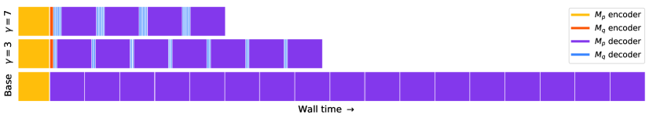

# Fast Inference from Transformers via Speculative Decoding

> **保真度：核心机制复现**。原文结论、本地公开数据实验和未复刻部分分开陈述。

## 论文信息

| 项目 | 内容 |
| --- | --- |
| 论文链接 | [ICML 2023 Oral](https://arxiv.org/abs/2211.17192) |
| 公司/机构 | Google Research |
| 首次公开日期 | 2022-11-30（arXiv v1） |
| 原文开源代码 | 是：[官方/作者代码](https://github.com/google-research/google-research/tree/master/speculative_decoding) |
| Adapter | `speculative-decoding` |
| 本地复现代码 | [`src/auto_research/reproductions/speculative_decoding/`](https://github.com/daiwk/auto-research/tree/main/src/auto_research/reproductions/speculative_decoding/) |

## 原始论文总结

### 背景与主要改动

小 draft model 并行提出多个 token，target model 一次验证整个块；拒绝时从校正后的残差分布采样，从而严格保持 target 分布。


<!-- paper-figure:start -->
### 原论文关键图

[](https://ar5iv.labs.arxiv.org/html/2211.17192/assets/x4.png)

> **原论文 Figure 5（关键图）**：展示原论文方法的总体设计和关键组成。图片来自[原论文](https://arxiv.org/abs/2211.17192)，版权归原作者所有；点击图片可查看来源。
<!-- paper-figure:end -->

### 核心公式

$$
a(x)=\min(1,p(x)/q(x)),\quad p'(x)\propto[p(x)-q(x)]_+.
$$

### 论文离线与线上效果

T5-XXL 报告 2–3× 加速且输出分布完全一致。

## 本地复现

> **本地对照口径**：基线为 `target-only greedy decoding`，实验组为 `four-token draft and exact target verification`，只改变论文核心机制；`target_calls` 160.0000 → **40.0000，相对基线 -75.00%**。

```bash
auto-research reproduce --paper speculative-decoding --dataset-dir data --seed 42
```

固定指标见 [`metrics/public-seed42.json`](metrics/public-seed42.json)。

## 复现边界

在 WikiText-2 拟合 target/draft token 模型，真实执行提议、验证和拒绝回退；target 是小型 Markov LM，不等同于 T5-XXL kernel 延迟。 本地相对变化不得与原文指标混写。
