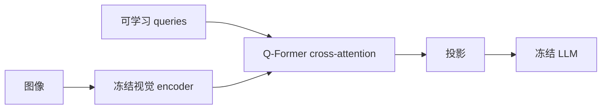
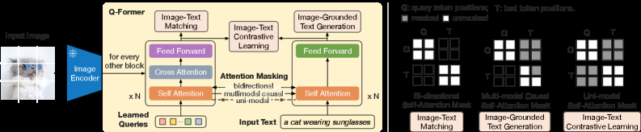

# BLIP-2：用 Q-Former 连接冻结视觉编码器与大语言模型

> **保真度：核心机制复现**。本地执行 Q-Former 的可学习 query 与 cross-attention；论文两阶段大规模预训练和冻结大模型未复刻。

## 论文信息

| 项目 | 内容 |
| --- | --- |
| 论文链接 | [ICML 2023](https://arxiv.org/abs/2301.12597) |
| 公司/机构 | Salesforce Research |
| 首次公开日期 | 2023-01-30（arXiv v1） |
| 原文开源代码 | 是：[官方 LAVIS/BLIP-2](https://github.com/salesforce/LAVIS) |
| Adapter | `blip2` |
| 本地复现代码 | [`src/auto_research/reproductions/blip2/`](https://github.com/daiwk/auto-research/tree/main/src/auto_research/reproductions/blip2/) |

## 原始论文总结

### 背景与主要改动

BLIP-2 冻结已有视觉 encoder 和 LLM，只训练轻量 Q-Former。固定数量的可学习 query 通过
cross-attention 从视觉 token 提取与语言最相关的信息；第一阶段做图文表征学习，第二阶段
将 query 输出投影成冻结 LLM 的 soft visual prompt。



<!-- paper-figure:start -->
### 原论文关键图

[](https://arxiv.org/html/2301.12597v3/x2.png)

> **原论文 Figure 2（关键图）**：展示原论文提出的核心架构、主要模块及其连接关系。图片来自[原论文](https://arxiv.org/abs/2301.12597)，版权归原作者所有；点击图片可查看来源。
<!-- paper-figure:end -->

### 核心公式

$$
Z=\operatorname{QFormer}(Q,E_v(I)),\qquad
H_v=WZ,\qquad
\mathcal L_{\mathrm{stage2}}=-\sum_t\log p(y_t\mid H_v,y_{<t}).
$$

### 论文离线与线上效果

论文在 zero-shot VQAv2 上比 Flamingo-80B 高 8.7 points，训练参数少 54 倍；同时报告
caption、VQA 和图文检索结果。论文没有工业线上 A/B 实验。

## 本地复现

> **本地对照口径**：基线为相同预算的线性 mean-pooling connector，实验组为四 query Q-Former；test accuracy `46.8% → 41.5%`（**-5.3 points**），但视觉 token `16 → 4`（**-75%**）。

```bash
auto-research reproduce --paper blip2 --dataset-dir data --seed 42
```

固定指标见 [`metrics/fashion-mnist-qa-seed42.json`](metrics/fashion-mnist-qa-seed42.json)。

负结果说明在 2,000 条图像、120 steps 下，query bottleneck 节省 token 但训练不足，不能把
论文的大模型收益直接外推到小模型。

## 复现边界

使用 Fashion-MNIST 真实像素和四 query multi-head cross-attention；没有加载 ViT-g、
OPT/FlanT5，也没有执行 ITC/ITM/ITG 两阶段 129M 图像预训练。
