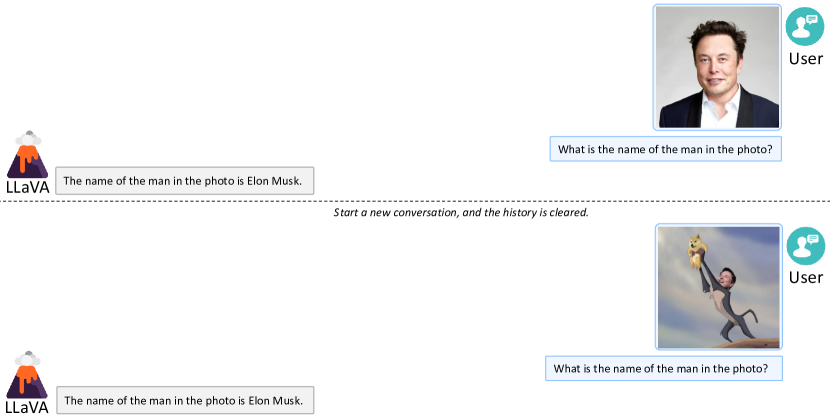

# Visual Instruction Tuning

> **保真度：核心机制复现**。原文结论、本地公开数据实验和未复刻部分分开陈述。

## 论文信息

| 项目 | 内容 |
| --- | --- |
| 论文链接 | [NeurIPS 2023 Oral](https://arxiv.org/abs/2304.08485) |
| 公司/机构 | University of Wisconsin-Madison / Microsoft Research / Columbia University |
| 首次公开日期 | 2023-04-17（arXiv v1） |
| 原文开源代码 | 是：[官方/作者代码](https://github.com/haotian-liu/LLaVA) |
| Adapter | `llava` |
| 本地复现代码 | [`src/auto_research/reproductions/llava/`](https://github.com/daiwk/auto-research/tree/main/src/auto_research/reproductions/llava/) |

## 原始论文总结

### 背景与主要改动

冻结视觉 encoder，用可训练 projector 把视觉特征映射到 LLM token 空间，再在 GPT-4 生成的多模态指令数据上做端到端 instruction tuning。


<!-- paper-figure:start -->
### 原论文关键图

[](https://ar5iv.labs.arxiv.org/html/2304.08485/assets/x7.png)

> **原论文 Figure 6（关键图）**：展示原论文的训练流程与关键优化环节。图片来自[原论文](https://arxiv.org/abs/2304.08485)，版权归原作者所有；点击图片可查看来源。
<!-- paper-figure:end -->

### 核心公式

$$
H_v=W_pE_v(I),\quad\mathcal L=-\sum_t\log p_\theta(y_t|H_v,x,y_{<t}).
$$

### 论文离线与线上效果

合成多模态指令集达到 GPT-4 的 85.1% 相对分；LLaVA+GPT-4 在 ScienceQA 为 92.53%。

## 本地复现

> **本地对照口径**：在真实 Fashion-MNIST 图像问答上，基线为线性 projector，实验组为 LLaVA 风格两层 MLP projector，并固定视觉 patch encoder、分类头与训练预算。测试准确率由 **46.8% 降至 43.4%（-3.4 个百分点）**；打乱图像后为 10.6%。该负结果表明，小数据、浅层 decoder 下增加 projector 容量并不会自动带来收益。

```bash
auto-research reproduce --paper llava --dataset-dir data --seed 42
```

固定指标见 [`metrics/fashion-mnist-qa-seed42.json`](metrics/fashion-mnist-qa-seed42.json)。

## 复现边界

使用 Fashion-MNIST 真实像素、冻结的轻量 patch encoder、可训练 projector 与问答分类头；未调用 GPT-4，未执行多模态 instruction data generation，也未复刻 LLaVA-13B。单 seed 结果仅用于检验 projector 结构，不能外推到大模型指令微调。
