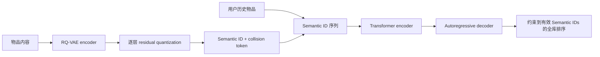

# TIGER：Recommender Systems with Generative Retrieval

> 保真度：**核心机制复现**。RQ-VAE、残差语义 ID、collision token 和自回归 Transformer 检索链路均实际训练；MovieLens genre 替代 Sentence-T5 商品文本，省略 hashed user token 与 cold-start epsilon mixing。

论文：[arXiv 2305.05065](https://arxiv.org/abs/2305.05065)

## 背景与主要改动

传统召回为每个物品维护独立 ID embedding，难以共享语义，也无法自然生成新物品。TIGER 先把内容向量量化成分层 Semantic ID，再让 encoder-decoder 像生成 token 一样生成下一个物品；同一语义前缀的冲突由额外 token 消解。



## 核心公式

RQ-VAE 逐层量化 residual：

\[
r_0=z_e(x),\quad c_l=\arg\min_j\lVert r_{l-1}-e_{l,j}\rVert^2,\quad
r_l=r_{l-1}-e_{l,c_l}.
\]

物品 ID 为 \((c_1,c_2,c_3,c_{collision})\)。生成器最大化条件概率
\(\sum_t\log p(c_t\mid c_{<t},\mathrm{history})\)；本地推理对所有有效物品 ID 求逐 token log-probability 之和，不用打分融合代理。

## 论文报告效果

- 离线：论文在 Amazon Sports/Beauty/Toys 报告 TIGER Recall@10 0.0400/0.0648/0.0712，NDCG@10 0.0225/0.0384/0.0432；相对当时最佳 baseline 的 NDCG@10 分别 +10.29%/+17.43%/+14.97%。
- 在线：论文没有报告真实生产线上 A/B。

TIGER 是用户明确指定的生成式推荐经典例外，不改变工业论文线上 A/B 硬门槛。

## 本地复现

MovieLens-100K 的 19 维 genre 内容，932 个有效用户、1,682 个物品，全库生成式排名。RQ-VAE 训练 240 step；三个生成器 seed 各 240 step。对照使用随机分层 ID，并强制相同四层词表容量和相同 155,760 参数，避免随机 ID 因小词表获益。

RQ-VAE loss 从 0.07172 降至 0.01497，但 1,682 个物品只有 199 个不同三层语义前缀，collision token 需要 376 个取值，说明 genre 信息过粗。

| ID scheme | Hit@10 | NDCG@10 | Head share@10 |
|---|---:|---:|---:|
| Matched random ID | 0.02039 ± 0.00836 | 0.01043 ± 0.00190 | 0.55755 |
| TIGER semantic ID | 0.01395 ± 0.00488 | 0.00635 ± 0.00182 | 0.39270 |

Semantic ID 相对 matched random ID 的 NDCG@10 为 **-39.16%**。核心生成链路可运行，但该结果明确显示：只有粗粒度 genre 时，RQ Semantic ID 的强碰撞会抵消语义共享收益。更接近论文的下一步应使用 Amazon 商品文本和 Sentence-T5，而不是继续增加 decoder step 掩盖内容瓶颈。

审计指标见 [metrics/movielens-100k-seeds42-44.json](metrics/movielens-100k-seeds42-44.json)。

## 复现命令

```bash
AUTO_RESEARCH_TIGER_RQVAE_STEPS=240 AUTO_RESEARCH_TIGER_STEPS=240 \
  auto-research reproduce --paper tiger --seed 42
```
