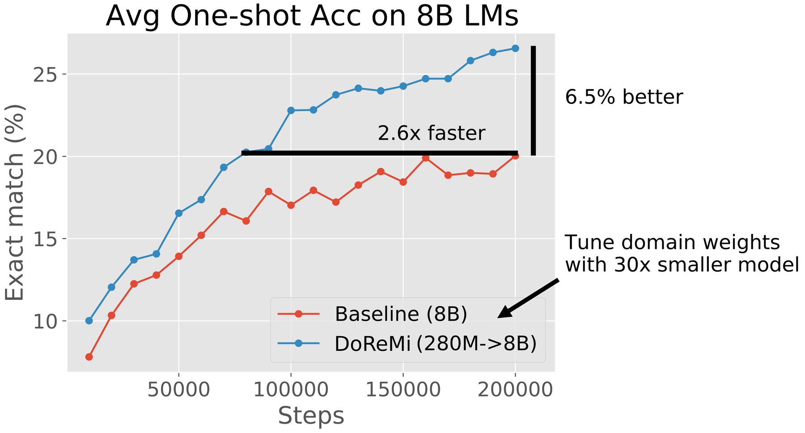

# DoReMi: Optimizing Data Mixtures Speeds Up Language Model Pretraining

> **保真度：核心机制复现**。原文结论、本地公开数据实验和未复刻部分分开陈述。

## 论文信息

| 字段 | 内容 |
|---|---|
| 论文链接 | [arXiv 2305.10429](https://arxiv.org/abs/2305.10429) |
| 公司/机构 | Stanford University / Google Research |
| 首次公开日期 | 2023-05-17（arXiv v1） |
| 原文开源代码 | 是：[原作者仓库](https://github.com/sangmichaelxie/doremi) |
| Adapter | `doremi` |
| 本地复现代码 | [`src/auto_research/reproductions/doremi/`](https://github.com/daiwk/auto-research/tree/main/src/auto_research/reproductions/doremi/) |

## 原始论文总结

### 背景与主要改动

用小型 proxy model 的 excess loss 做 group DRO，动态提升欠拟合域权重，再按所得配比训练目标模型。


<!-- paper-figure:start -->
### 原论文关键图

[](https://ar5iv.labs.arxiv.org/html/2305.10429/assets/figures/pile_8B_fewshot_annotated.png)

> **原论文 Figure 2（关键图）**：展示原论文的训练流程与关键优化环节。图片来自[原论文](https://arxiv.org/abs/2305.10429)，版权归原作者所有；点击图片可查看来源。
<!-- paper-figure:end -->

### 核心公式

$$
\alpha_d\leftarrow\frac{\alpha_d\exp(\eta[L_d-L_d^{ref}])}{\sum_j\alpha_j\exp(\eta[L_j-L_j^{ref}])}.
$$

### 论文离线与线上效果

原文在 The Pile 上以更少训练步达到 baseline 8B 模型的平均性能。

## 本地复现

> **本地对照口径**：基线为均匀数据混合，实验组为 `doremi`；相对 validation loss -0.15%。

WikiText-2 + public narrative、seed 42：validation loss 5.6729 → **5.6645（-0.15%）**；公开 token 与验证口径一致。

```bash
auto-research reproduce --paper doremi --dataset-dir data --seed 42
auto-research evolve --model micro-llm --dataset wikitext-2 --direction "组合 doremi 与已安装论文算子" --generations 2 --population 4
```

固定指标见 [`metrics/public-seed42.json`](metrics/public-seed42.json)。

## 复现边界

实际在两个公开文本域上训练 reference unigram proxy，执行 group-DRO excess-loss 指数权重更新，再以所学配比评估；未复刻 The Pile、280M proxy 与 8B target。 本地数值不等同于原论文大模型、私有数据、生产流量或专用 kernel；本地相对变化不得与原文提升混写。
