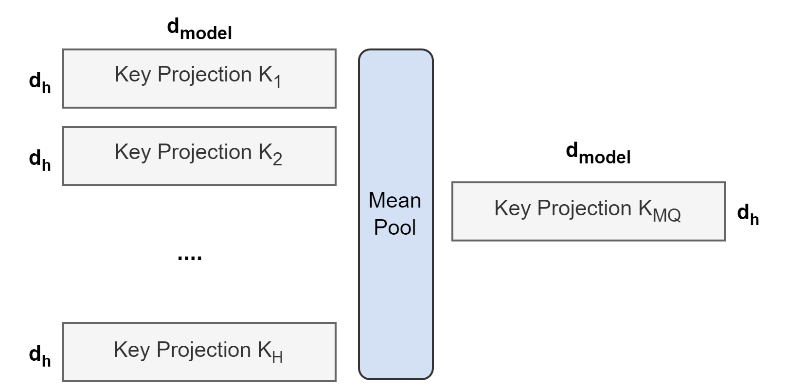

# GQA: Training Generalized Multi-Query Transformer Models from Multi-Head Checkpoints

> **保真度：核心机制复现**。原文结论、本地公开数据实验和未复刻部分分开陈述。

## 论文信息

| 项目 | 内容 |
| --- | --- |
| 论文链接 | [arXiv 2305.13245](https://arxiv.org/abs/2305.13245) |
| 公司/机构 | Google Research |
| 首次公开日期 | 2023-05-22（arXiv v1） |
| 原文开源代码 | 否：论文未提供官方/作者代码（核查日期：2026-08-09） |
| Adapter | `gqa` |
| 本地复现代码 | [`src/auto_research/reproductions/gqa/`](https://github.com/daiwk/auto-research/tree/main/src/auto_research/reproductions/gqa/) |

## 原始论文总结

### 背景与主要改动

多个 query head 共享较少的 K/V head，在 MHA 质量与 MQA 解码带宽之间取得可控折中。


<!-- paper-figure:start -->
### 原论文关键图

[](https://ar5iv.labs.arxiv.org/html/2305.13245/assets/images/recycling.png)

> **原论文 Figure 1（关键图）**：展示原论文方法的总体设计和关键组成。图片来自[原论文](https://arxiv.org/abs/2305.13245)，版权归原作者所有；点击图片可查看来源。
<!-- paper-figure:end -->

### 核心公式

$$
Q_h=XW_h^Q,\quad K_h=XW_{g(h)}^K,\ V_h=XW_{g(h)}^V,\quad N_{KV}<N_Q.
$$

### 论文离线与线上效果

原文通过少量 uptraining 将 MHA checkpoint 转为 GQA，质量接近 MHA、速度接近 MQA。

## 本地复现

> **本地对照口径**：基线为同预算 `llama_modern`，实验组为 `gqa`；相对 PPL +2.15%。

WikiText-2、12 steps、64d/2-layer、seed 42：PPL 421.18 → **430.22（+2.15%）**；参数、token、优化器和步数相同。

```bash
auto-research reproduce --paper gqa --dataset-dir data --seed 42
auto-research evolve --model micro-llm --dataset wikitext-2 --direction "组合 gqa 与已安装论文算子" --generations 2 --population 4
```

固定指标见 [`metrics/public-seed42.json`](metrics/public-seed42.json)。

## 复现边界

实际让 4 个 query heads 分组共享 2 个 K/V heads，并报告 KV cache 缩减；从头小模型训练替代论文从 MHA checkpoint 的 5% compute uptraining。 本地数值不等同于原论文大模型、私有数据、生产流量或专用 kernel；本地相对变化不得与原文提升混写。
