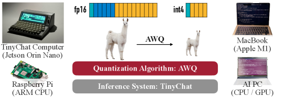

# AWQ: Activation-aware Weight Quantization for LLM Compression and Acceleration

> **保真度：核心机制复现**。原文结论、本地公开数据实验和未复刻部分分开陈述。

## 论文信息

| 字段 | 内容 |
|---|---|
| 论文链接 | [MLSys 2024 Best Paper](https://arxiv.org/abs/2306.00978) |
| 公司/机构 | MIT / NVIDIA / Harvard / SJTU |
| 首次公开日期 | 2023-06-01（arXiv v1） |
| 原文开源代码 | 是：[原作者仓库](https://github.com/mit-han-lab/llm-awq) |
| Adapter | `awq` |
| 本地复现代码 | [`src/auto_research/reproductions/awq/`](https://github.com/daiwk/auto-research/tree/main/src/auto_research/reproductions/awq/) |

## 原始论文总结

### 背景与主要改动

利用 calibration activation 找到显著输入通道，通过等价通道缩放保护约 1% 关键权重，再执行硬件友好的统一低比特 weight-only 量化。


<!-- paper-figure:start -->
### 原论文关键图

[](https://arxiv.org/html/2306.00978v6/x1.png)

> **原论文 Figure 1（关键图）**：展示原论文方法的总体设计和关键组成。图片来自[原论文](https://arxiv.org/abs/2306.00978)，版权归原作者所有；点击图片可查看来源。
<!-- paper-figure:end -->

### 核心公式

$$
XW=(X S^{-1})(S W),\quad S_j=(\mathbb E|X_j|)^\alpha,\quad \alpha^*=\arg\min\|XW-XS^{-1}Q(SW)\|^2.
$$

### 论文离线与线上效果

AWQ 在语言、代码、数学与多模态模型上优于既有 PTQ；TinyChat 在桌面和移动 GPU 上超过 FP16 3×。

## 本地复现

> **本地对照口径**：基线为 `round-to-nearest W4`，实验组为 `activation-aware equivalent scaling W4`，只改变论文核心机制；`output_mse` 0.0054 → **0.0052，相对基线 -4.22%**。

```bash
auto-research reproduce --paper awq --dataset-dir data --seed 42
```

固定指标见 [`metrics/public-seed42.json`](metrics/public-seed42.json)。

## 复现边界

用 WikiText-2 激活统计搜索 AWQ 等价缩放并真实执行 W4 量化；未使用 TinyChat CUDA kernel，MSE 不代表端到端吞吐。 本地相对变化不得与原文指标混写。
