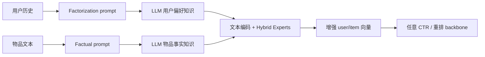

# KAR：用 LLM 开放世界知识增强推荐

> **Fidelity: 完整核心链路复现**。真实执行 factorization prompts、用户偏好/物品事实知识生成、离线缓存、hybrid-expert adapter 和下游 CTR 训练；PanGu 与华为日志替换为 SmolLM2-135M-Instruct 和 MovieLens-100K。

- 论文：[arXiv 2306.10933](https://arxiv.org/abs/2306.10933)，Huawei 等
- 博客线索：[LLM + 推荐系统](https://www.daiwk.net/1.7.llm_recommend)
- Adapter：`kar`；代码：`src/auto_research/reproductions/kar/`

## 原始论文总结

### 背景与主要改动

封闭域推荐只能从本域交互学习，难以理解物品事实和用户偏好背后的常识。KAR 不把 LLM 直接当在线推荐器，而是通过 factorization prompting 让 LLM 分别产出用户偏好推理知识与物品事实知识，再用 hybrid-expert adapter 压缩成与 ID 推荐模型兼容的向量。知识可预生成并缓存，因此线上不承担 LLM 自回归延迟。



### 核心公式

对知识表示 $z$，hybrid-expert adapter 用门控组合共享与专属专家：

$$
a(z)=\sum_{e=1}^{E}g_e(z)f_e(z),\qquad g(z)=\mathrm{softmax}(W_gz).
$$

增强表示与原 ID 表示共同进入推荐器，二分类以 BCE 优化：

$$
\hat y=R([e_u,e_i,a(z_u),a(z_i)]),\qquad
\mathcal L=-y\log\hat y-(1-y)\log(1-\hat y).
$$

### 论文离线与线上效果

MovieLens-1M 上 DIN AUC 从 0.7863 提升到 **0.7961**，Amazon-Books 从 0.8304 到 **0.8418**；9 个 CTR backbone 的 AUC 普遍提升约 1%～1.5%。Amazon-Books 重排中，PRM 的 MAP@7 / NDCG@7 相对提升 5.71% / 4.71%。

真实线上证据：华为新闻召回指标 **+7%**；音乐推荐采用 10% treatment / 10% control、持续 7 天，歌曲播放量 **+1.70%**、播放设备数 **+1.64%**、总播放时长 **+1.57%**。

## 本地复现

> **本地对照口径**：基线是纯 ID ranker；实验组是加入 LLM 知识与四专家 adapter 的 KAR；AUC 从 0.72188 升至 0.72774（**+0.81%**）。这是知识增强模块消融，不是相对 DIN 的比较。

按用户时间切分 MovieLens-100K。SmolLM2-135M-Instruct 为 20 个用户和涉及的物品实际生成 875 个知识 prompt，最终隐藏状态形成知识向量并落到 Git 忽略缓存；比较纯 ID ranker 与加入四专家 adapter 的 KAR ranker。

| Method | AUC mean ± std | 相对 ID ranker |
|---|---:|---:|
| ID ranker | 0.72188 ± 0.01086 | — |
| KAR hybrid-expert | **0.72774 ± 0.00627** | **+0.81%** |

逐 seed 的 KAR 相对表现为 `-0.67% / +1.95% / +1.19%`，2/3 正向；均值支持小幅收益趋势，但样本只有 20 用户，不能视作稳健重现论文工业增益。结构化指标见 [`metrics/movielens-100k-seeds42-44.json`](metrics/movielens-100k-seeds42-44.json)。

```bash
pip install -e '.[plum]'
for seed in 42 43 44; do
  AUTO_RESEARCH_KAR_USERS=20 AUTO_RESEARCH_KAR_STEPS=100 \
  AUTO_RESEARCH_KAR_TRAIN=3000 AUTO_RESEARCH_KAR_TEST=600 \
  auto-research reproduce --paper kar --dataset-dir data --seed "$seed"
done
```

模型、知识缓存、数据、运行报告和 checkpoint 均不提交 Git；只提交复核后的指标与复现命令。
