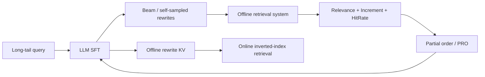

# BEQUE：离线检索反馈对齐的大模型 Query Rewrite

> **Fidelity: 完整核心链路复现**。真实执行 seq2seq SFT、beam self-sampling、离线检索反馈、partial order 构造和 rank-aware PRO；Qwen-7B/淘宝搜索替换为 T5-small/MovieLens 公开目录。

- 论文：[arXiv 2311.03758](https://arxiv.org/abs/2311.03758)，Alibaba
- 博客线索：[LLM + 推荐系统](https://www.daiwk.net/1.7.llm_recommend)
- Adapter：`beque`；代码：`src/auto_research/reproductions/beque/`

## 原始论文总结

### 背景与主要改动

长尾电商 query 存在语义缺口，单纯 SFT 只模仿人工 rewrite，未直接对齐召回质量。BEQUE 先用拒绝采样和多指令数据 SFT，再让模型为每个 query 自采样多个 rewrite；淘宝离线搜索系统从 relevance、retrieval increment、hit rate 打分并形成偏序，最后用 Preference Ranking Optimization（PRO）把排序反馈对齐回 LLM。生产 serving 采用离线刷库 + 在线 KV，不把 7B 自回归模型放进请求链路。



### 核心公式

对同一 query 的候选排序 $y_1\succ y_2\succ\cdots\succ y_K$，以长度归一化序列 log-probability $s_\theta(q,y)$ 建立 rank-aware 对比：

$$s_\theta(q,y)=\frac{1}{|y|}\sum_t\log p_\theta(y_t\mid q,y_{<t}),$$

$$\mathcal L_{PRO}=-\sum_{i=1}^{K-1}\log\frac{\exp(s_i/\tau_i)}{\sum_{j=i}^{K}\exp(s_j/\tau_i)}+\lambda\mathcal L_{SFT}.$$

本地离线反馈同样由 relevance、相对新增召回和 Hit@1 组合，反馈只负责排序模型真实生成的候选，不替代生成训练。

### 论文离线与线上效果

论文全量 query 上，Qwen(SFT) 的 relevance / increment / hitrate 为 61.4 / 109.6 / 14.58；BEQUE 按 increment 对齐后为 57.7 / **198.7** / **17.27**，体现多目标权衡。线上通过离线表覆盖约 27% PV，几乎不增加检索延迟。

淘宝搜索 14 天 A/B：全 query 的 GMV **+0.40%**、交易数 **+0.34%**、UV **+0.33%**；命中 rewrite 的 covered queries 分别 **+2.96% / +1.36% / +1.22%**；`nothing` queries 的 GMV 达 **+18.66%**。

## 本地复现

MovieLens 标题/类型构造公开商品目录式 query-rewrite 任务。T5-small 先 SFT，随后每个 query 生成 4 个 beam；倒排目录计算 relevance、increment 和 Hit@1，构造 160 组偏序并运行 PRO。3 seeds、600 train / 100 test、40 SFT + 15 PRO steps：

| Metric | SFT mean ± std | SFT + PRO mean ± std | 相对变化 |
|---|---:|---:|---:|
| Combined feedback | 0.62102 ± 0.08473 | **0.80750 ± 0.20024** | **+30.03%** |
| Hit@1 | 0.32333 ± 0.04041 | **0.51333 ± 0.11930** | **+58.76%** |
| Relevance | 0.26116 ± 0.04671 | **0.28176 ± 0.07902** | **+7.89%** |
| Increment | **0.18267 ± 0.03609** | 0.06208 ± 0.01547 | **-66.02%** |

综合反馈逐 seed 增量是 `+0.0056 / +0.1310 / +0.4228`，3/3 正向，但 PRO 明显偏向 Hit@1 并牺牲了新增召回词。训练偏序只含模型生成候选和无标签 fallback，绝不注入 SFT target。因而本地支持“偏序对齐能改变并提高被优化的组合目标”，不支持所有子目标同时提升。公开电影目录也只是搜索反馈代理，不等于淘宝日志。指标见 [`metrics/movielens-100k-seeds42-44.json`](metrics/movielens-100k-seeds42-44.json)。

```bash
pip install -e '.[plum]'
for seed in 42 43 44; do
  AUTO_RESEARCH_BEQUE_SFT_STEPS=40 AUTO_RESEARCH_BEQUE_PRO_STEPS=15 \
  AUTO_RESEARCH_BEQUE_TRAIN=600 AUTO_RESEARCH_BEQUE_TEST=100 \
  auto-research reproduce --paper beque --dataset-dir data --seed "$seed"
done
```

模型与 checkpoint 不进入 Git；论文生产 query/retrieval 数据不可公开，本实现只承诺核心训练链路而非生产数据复刻。
