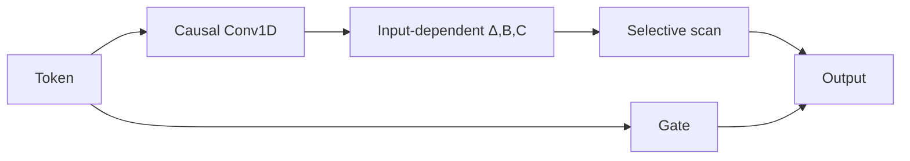

# Mamba

> **Fidelity: 核心机制复现**。实现输入相关的 selective SSM、因果 depthwise convolution 与门控输出。

## 论文信息

| 项目 | 内容 |
| --- | --- |
| 论文链接 | [arXiv 2312.00752](https://arxiv.org/abs/2312.00752) |
| 公司/机构 | Carnegie Mellon University / Princeton University |
| 首次公开日期 | 2023-12-01（arXiv v1） |
| 原文开源代码 | 是：[官方/作者代码](https://github.com/state-spaces/mamba) |
| Adapter | `mamba` |
| 本地复现代码 | [`src/auto_research/reproductions/mamba/`](https://github.com/daiwk/auto-research/tree/main/src/auto_research/reproductions/mamba/) |

## 原始论文总结

### 背景与主要改动

Mamba 让 SSM 的步长、读写向量依赖当前 token，从而选择性保留信息，同时保持序列长度线性复杂度。



### 核心公式

$$
h_t=\exp(\Delta_tA)h_{t-1}+\Delta_tB_t x_t,\qquad y_t=C_t h_t.
$$

### 论文离线与线上效果

论文在语言、音频与基因组任务上匹配或超过 Transformer，并报告推理吞吐最高约 **5×**、序列长度线性扩展；无线上 A/B。

## 本地复现

> **本地对照口径**：基线是 tiny Transformer；实验组是原生 PyTorch selective scan；WikiText-2 30-step perplexity 相对 **+48.82%**（变差）。

```bash
auto-research reproduce --paper mamba
```

结构化结果见 [`metrics/wikitext2-seed42.json`](metrics/wikitext2-seed42.json)。

## 复现边界

未使用 fused parallel scan CUDA kernel，也没有 2.8B 规模预训练；短预算结果不代表论文规模结论。
