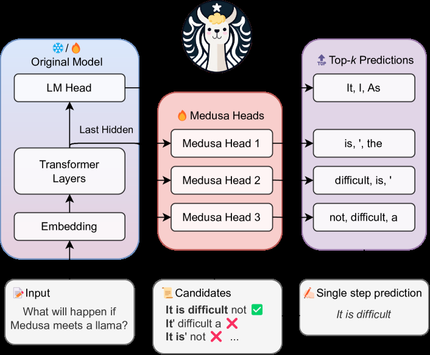

# Medusa: Simple LLM Inference Acceleration Framework with Multiple Decoding Heads

> **保真度：核心机制复现**。原文结论、本地公开数据实验和未复刻部分分开陈述。

## 论文信息

| 字段 | 内容 |
|---|---|
| 论文链接 | [arXiv 2401.10774](https://arxiv.org/abs/2401.10774) |
| 公司/机构 | Together AI / Princeton University / University of Illinois Urbana-Champaign |
| 首次公开日期 | 2024-01-19（arXiv v1） |
| 原文开源代码 | 是：[原作者仓库](https://github.com/FasterDecoding/Medusa) |
| Adapter | `medusa` |
| 本地复现代码 | [`src/auto_research/reproductions/medusa/`](https://github.com/daiwk/auto-research/tree/main/src/auto_research/reproductions/medusa/) |

## 原始论文总结

### 背景与主要改动

在冻结或联合微调的 backbone 上增加多个 future-token heads，以 tree attention 同时验证候选分支，减少串行解码步数。


<!-- paper-figure:start -->
### 原论文关键图

[](https://ar5iv.labs.arxiv.org/html/2401.10774/assets/x1.png)

> **原论文 Figure 1（关键图）**：展示原论文的训练流程与关键优化环节。图片来自[原论文](https://arxiv.org/abs/2401.10774)，版权归原作者所有；点击图片可查看来源。
<!-- paper-figure:end -->

### 核心公式

$$
\mathcal L=\sum_{k=1}^K\lambda_k\operatorname{CE}(p_k(x_{t+k}|h_t),x_{t+k}).
$$

### 论文离线与线上效果

Medusa-1 超过 2.2×，Medusa-2 为 2.3–3.6×，并保持生成质量。

## 本地复现

> **本地对照口径**：基线为 `single-head greedy`，实验组为 `three future heads + tree verification`，只改变论文核心机制；`backbone_calls` 160.0000 → **80.0000，相对基线 -50.00%**。

```bash
auto-research reproduce --paper medusa --dataset-dir data --seed 42
```

固定指标见 [`metrics/public-seed42.json`](metrics/public-seed42.json)。

## 复现边界

在 WikiText-2 token 转移模型上执行多 future head、候选树和 backbone 验证；未复刻 GPU tree-attention kernel。 本地相对变化不得与原文指标混写。
