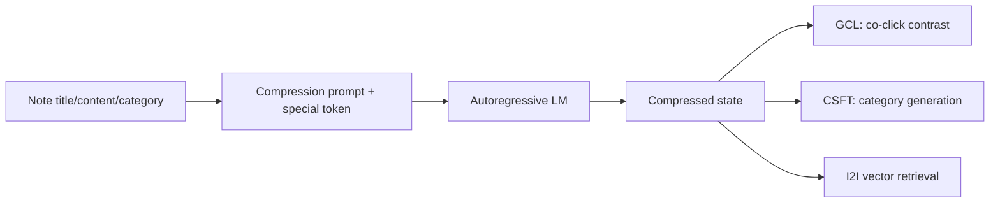

# NoteLLM：把协同信号注入可检索 LLM

> **Fidelity: 完整核心链路复现**。真实执行 note compression special token、行为共现 GCL、类别生成 CSFT 和压缩状态 I2I 检索；T5-small/MovieLens 替代 7B LLM/小红书 note。

- 论文：[arXiv 2403.01744](https://arxiv.org/abs/2403.01744)，Xiaohongshu
- Adapter：`notellm`；运行：`auto-research reproduce --paper notellm --seed 42`

## 原论文

纯文本 embedding 缺少协同信号，纯对比学习又可能损害 LLM 生成能力。NoteLLM 用统一 compression prompt 将内容压到特殊 token；GCL 拉近用户共读 note，CSFT 从同一压缩状态生成 hashtag/category。



$$\mathcal L=\mathcal L_{GCL}+\lambda\mathcal L_{CSFT},\quad
\mathcal L_{GCL}=-\log\frac{e^{z_i^\top z_j/\tau}}{\sum_k e^{z_i^\top z_k/\tau}},\quad
\mathcal L_{CSFT}=-\sum_t\log p(o_t|o_{<t},prompt).$$

论文 Recall@100：SentenceBERT 70.72%、RepLLaMA 83.63%、NoteLLM **84.02%**。小红书一周 I2I A/B：CTR **+16.20%**、评论数 +1.10%、周发布者 +0.41%，新 note 评论 +3.58%。

## 本地结果

| Model | Hit@10 | NDCG@10 |
|---|---:|---:|
| Frozen compression state | 0.01931 | 0.01142 |
| NoteLLM GCL + CSFT | **0.02110 ± 0.00223** | **0.01224 ± 0.00037** |

Hit@10 +9.26%、NDCG@10 +7.15%，3/3 seeds 的 NDCG 正向。公开数据只有 title/genre，生成任务比真实 hashtag 简单，结论只支持联合目标的本地趋势。指标见 [`metrics/movielens-100k-seeds42-44.json`](metrics/movielens-100k-seeds42-44.json)。

```bash
for seed in 42 43 44; do AUTO_RESEARCH_NOTELLM_STEPS=40 auto-research reproduce --paper notellm --dataset-dir data --seed "$seed"; done
```
