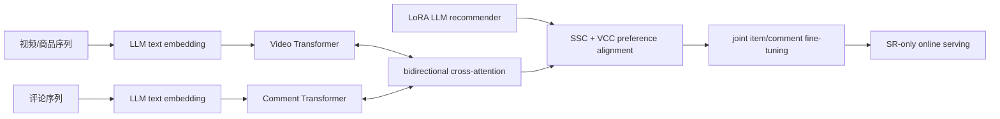

# LSVCR：把 LLM 推荐偏好对齐进可线上服务的双序列模型

> **Fidelity: 完整核心链路复现**。真实执行 causal LM q/v-LoRA SFT、LLM 文本编码、随机位置扩展、商品/评论双 Transformer、双向 cross-attention、SSC/VCC 对齐和联合微调；ChatGLM3 与快手私有日志缩小替换。

## 论文信息

| 项目 | 内容 |
| --- | --- |
| 论文链接 | [arXiv 2403.13574](https://arxiv.org/abs/2403.13574) |
| 公司/机构 | Kuaishou |
| 首次公开日期 | 2024-03-20（arXiv v1） |
| 原文开源代码 | 是：[官方/作者代码](https://github.com/RUCAIBox/LSVCR) |
| Adapter | `lsvcr` |
| 本地复现代码 | [`src/auto_research/reproductions/lsvcr/`](https://github.com/daiwk/auto-research/tree/main/src/auto_research/reproductions/lsvcr/) |

## 原始论文总结

### 背景与主要改动

短视频用户会同时消费视频和评论。纯序列模型能高效服务，但难以理解评论语义；直接让 LLM 在线推荐又太慢。LSVCR 用 LLM 同时担任离线文本 encoder 和仅训练期存在的 supplemental recommender，再把 LLM 的个性化偏好对齐到可部署的双序列 SR 模型。部署时不需要运行生成式 LLM。



### 核心公式

文本与 ID 表示进入两条序列，再做双向交叉融合：

$$
H^v=T_v(E^v+P^v),\quad H^c=T_c(E^c+P^c),
$$
$$
\tilde H^v=\operatorname{MHA}(H^v,H^c,H^c),\quad
\tilde H^c=\operatorname{MHA}(H^c,H^v,H^v).
$$

随机位置编码在短 alignment 序列中抽取完整位置表的有序子集。SSC 将 SR 偏好 $s$ 与 LoRA LLM 偏好 $\tilde s$ 做 InfoNCE；VCC 对齐商品与评论偏好：

$$
\mathcal L_{align}=\mathcal L_{SSC}+\mu\mathcal L_{VCC},\qquad
\mathcal L_{SSC}=-\log\frac{e^{\operatorname{sim}(s_i,\tilde s_i)/\tau}}{\sum_j e^{\operatorname{sim}(s_i,\tilde s_j)/\tau}}.
$$

### 论文离线与线上效果

工业离线数据上，LSVCR 的视频 Recall@10/NDCG@10 为 **0.3322/0.2233**，评论为 **0.3901/0.2541**；去掉 alignment 后分别为 0.3071/0.1998 与 0.3505/0.2176。

快手 20K 用户、两周 A/B：视频观看时长 **+0.3649%**、互动数 **+0.7821%**；评论观看时长 **+4.1264%**、互动数 **+1.3557%**。

## 本地复现

> **本地对照口径**：基线是相同 SR 网络但不做 LLM preference alignment；实验组是完整 LSVCR；Comment NDCG@10 **+50.40%**，Item NDCG@10 **-56.42%**。这是 alignment 消融，不能概括成整体推荐效果提升。

Amazon Beauty 5-core 同时提供真实商品交互与 review 文本。80 个用户产生 688 个商品、748 条评论、508 个训练样本和 80 个 test 样本。SmolLM2-135M 的 q/v projection 注入 **230,400** 个 LoRA 参数；LoRA 生成式 SFT 后，SR 做 80 steps 对齐与 120 steps 联合微调。对照组使用完全相同 SR 网络但不做 LLM preference alignment。

| Method | Item NDCG@10 | Comment NDCG@10 |
|---|---:|---:|
| Without alignment | 0.013680 ± 0.011071 | 0.010354 ± 0.005688 |
| LSVCR | 0.005961 ± 0.008430 | **0.015573 ± 0.006893** |

评论 NDCG@10 平均相对 **+50.40%**，3/3 seeds 正向；商品 NDCG@10 相对 **-56.42%**，只有 1/3 seeds 正向。因此只复现了“评论端获益更显著”的方向，没有复现双任务同时提升。对齐 loss 明显下降，排除了 alignment 根本未训练的情况。指标见 [`metrics/amazon-beauty-seeds42-44.json`](metrics/amazon-beauty-seeds42-44.json)。

```bash
pip install -e '.[plum]'
for seed in 42 43 44; do
  AUTO_RESEARCH_LSVCR_USERS=80 AUTO_RESEARCH_LSVCR_LORA_STEPS=24 \
  AUTO_RESEARCH_LSVCR_ALIGN_STEPS=80 AUTO_RESEARCH_LSVCR_STEPS=120 \
  auto-research reproduce --paper lsvcr --dataset-dir data --seed "$seed"
done
```

LoRA 权重、LLM 表示缓存与原始运行均只保存在 Git 忽略目录。
