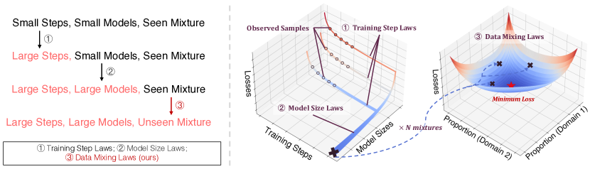

# Data Mixing Laws: Optimizing Data Mixtures by Predicting Language Modeling Performance

> **保真度：核心机制复现**。原文结论、本地公开数据实验和未复刻部分分开陈述。

## 论文信息

| 项目 | 内容 |
| --- | --- |
| 论文链接 | [arXiv 2403.16952](https://arxiv.org/abs/2403.16952) |
| 公司/机构 | University of Cambridge / Shanghai AI Laboratory |
| 首次公开日期 | 2024-03-25（arXiv v1） |
| 原文开源代码 | 是：[官方/作者代码](https://github.com/yegcjs/mixinglaws) |
| Adapter | `data-mixing-laws` |
| 本地复现代码 | [`src/auto_research/reproductions/data_mixing_laws/`](https://github.com/daiwk/auto-research/tree/main/src/auto_research/reproductions/data_mixing_laws/) |

## 原始论文总结

### 背景与主要改动

先训练多组小预算 domain mixture，拟合各评测域的混合缩放律，再搜索未训练过的最优配比。


<!-- paper-figure:start -->
### 原论文关键图

[](https://ar5iv.labs.arxiv.org/html/2403.16952/assets/x1.png)

> **原论文 Figure 1（关键图）**：展示原论文的整体流程、关键阶段及其数据流向。图片来自[原论文](https://arxiv.org/abs/2403.16952)，版权归原作者所有；点击图片可查看来源。
<!-- paper-figure:end -->

### 核心公式

$$
L_i(\mathbf p,N)=c_i+\sum_j a_{ij}p_j^{-\beta_{ij}}N^{-\gamma_i},\quad\mathbf p^*=\arg\min_{\Delta} \sum_iw_iL_i.
$$

### 论文离线与线上效果

原文用小模型曲线预测更大预算的 RedPajama 配比，并优于人工与均匀混合。

## 本地复现

> **本地对照口径**：基线为均匀数据混合，实验组为 `data-mixing-laws`；相对 validation loss -3.48%。

WikiText-2 + public narrative、seed 42：validation loss 5.6729 → **5.4758（-3.48%）**；公开 token 与验证口径一致。

```bash
auto-research reproduce --paper data-mixing-laws --dataset-dir data --seed 42
auto-research evolve --model micro-llm --dataset wikitext-2 --direction "组合 data-mixing-laws 与已安装论文算子" --generations 2 --population 4
```

固定指标见 [`metrics/public-seed42.json`](metrics/public-seed42.json)。

## 复现边界

实际用公开文本域的十组 pilot mixture 拟合逐域指数 mixing law，并在未训练配比网格上选择最优配比；小型 unigram proxy 不等同于 RedPajama 多模型 scaling curve。 本地数值不等同于原论文大模型、私有数据、生产流量或专用 kernel；本地相对变化不得与原文提升混写。
