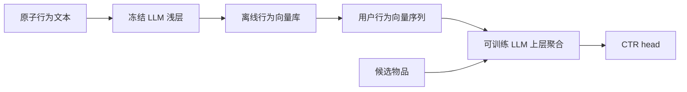

# BAHE：把长行为文本拆成可缓存的层次编码

> **Fidelity: 完整核心链路复现**。真实执行冻结浅层 LLM 的原子行为编码与落盘、可训练上层 Transformer 的行为聚合和 CTR 训练；生产 LLM/广告日志替换为 BERT-tiny/MovieLens-100K。

- 论文：[arXiv 2403.19347](https://arxiv.org/abs/2403.19347)，Ant Group
- 博客线索：[LLM + 推荐系统](https://www.daiwk.net/1.7.llm_recommend)
- Adapter：`bahe`；代码：`src/auto_research/reproductions/bahe/`

## 原始论文总结

### 背景与主要改动

直接把长用户行为文本反复送入 LLM，会重复编码同一原子行为，并把低层语义提取与高层行为交互强耦合。BAHE 在浅层编码每个原子行为并离线存储；训练时只取行为向量，以更深的可训练层聚合，再与候选物品一起完成 CTR 预测。这样既缩短上层序列，也允许浅层异步、低频更新。



### 核心公式

浅层只计算一次原子行为表示并缓存：

$$b_j=F_p(\mathrm{LLM}_{1:k}(x_j)),\qquad b_j\rightarrow\text{offline DB}.$$

训练时从数据库取回序列，由上层模型学习跨行为交互：

$$u=F_p(\mathrm{LLM}_{k+1:L}([b_1,\ldots,b_n,e_i])),\qquad
\hat y=\sigma(\mathrm{MLP}(u)).$$

计算从反复处理全部 token 的 $O(T^2L)$ 转向缓存低层后、上层处理行为数 $n$ 的 $O(n^2(L-k))$；实际收益取决于 token/行为压缩率和缓存命中率。

### 论文离线与线上效果

在 text length=2048 时，LLM-CTR 为 AUC 0.7276、928 GPU-h、75.4GB；BAHE 为 AUC 0.7309、**164 GPU-h、12.6GB**。迁移到下游 CTR 模型的 $AUC_d$ 为 0.7352（完整编码基线 0.7323）。生产上 8 张 A100 将 5000 万样本训练从 5 天降到 1 天，实现日更。

两周广告线上 A/B 中，CTR **+9.65%**、广告 CPM **+2.41%**。这里的业务增益包含“周更变日更”的时效性收益，不能只解释为静态网络精度差异。

## 本地复现

使用 BERT-tiny 第一层对 MovieLens 标题原子编码并缓存，复制其上层处理 `[CLS] + 12 条历史 + candidate`；对照组对完整文本逐次运行冻结低层和可训练上层。3 seeds、每组 5,000 train / 1,000 test、80 steps：

| Method | AUC mean ± std | ms/example mean ± std |
|---|---:|---:|
| Full-text upper tuning | **0.59757 ± 0.00767** | 0.5651 ± 0.0572 |
| BAHE cached hierarchy | 0.58002 ± 0.01326 | **0.2622 ± 0.0565** |

BAHE 本地端到端样本耗时下降 **53.61%**，但 AUC 相对下降 **2.94%**。因此只复现了效率机制，没有复现效果无损；小模型只有两层，浅/深分工空间远小于原生产 LLM，是重要边界。指标见 [`metrics/movielens-100k-seeds42-44.json`](metrics/movielens-100k-seeds42-44.json)。

```bash
pip install -e '.[plum]'
for seed in 42 43 44; do
  AUTO_RESEARCH_BAHE_STEPS=80 AUTO_RESEARCH_BAHE_TRAIN=5000 \
  AUTO_RESEARCH_BAHE_TEST=1000 \
  auto-research reproduce --paper bahe --dataset-dir data --seed "$seed"
done
```

原子向量、模型、数据和 checkpoint 均留在 Git 忽略目录；仓库只保存汇总指标。
