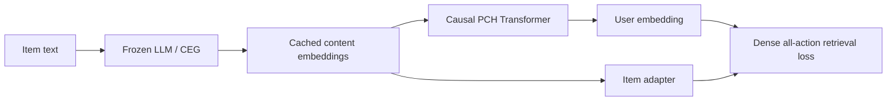

# LEARN：冻结 LLM 内容知识并适配到协同域

> **Fidelity: 完整核心链路复现**。真实执行冻结预训练 LM 的 CEG、缓存 item embedding、因果 PCH、dense all-position loss 和 online projection；BERT-tiny/MovieLens 替代 Baichuan2-7B/快手日志。

## 论文信息

| 项目 | 内容 |
| --- | --- |
| 论文链接 | [arXiv 2405.03988](https://arxiv.org/abs/2405.03988) |
| 公司/机构 | Kuaishou |
| 首次公开日期 | 2024-05-07（arXiv v1） |
| 原文开源代码 | 否：论文未提供官方/作者代码（核查日期：2026-07-15） |
| Adapter | `learn` |
| 本地复现代码 | [`src/auto_research/reproductions/learn/`](https://github.com/daiwk/auto-research/tree/main/src/auto_research/reproductions/learn/) |

## 原始论文总结

### 背景与主要改动

直接把冻结 LLM embedding 用作推荐表示存在开放世界语义域与协同域的差距。LEARN 的 CEG 冻结 LLM 并平均池化 item 文本，PCH 用可训练因果 Transformer 从历史 content embeddings 学用户偏好，再投影到线上推荐空间。



### 核心公式

$$
e_i^c=\mathrm{meanpool}(LLM(text_i)),\quad
u_{1:H}=PCH(e_{i_1}^c,\ldots,e_{i_H}^c),\quad
\mathcal L=-\sum_t\log\frac{e^{u_t^\top v_{t+1}}}{\sum_j e^{u_t^\top v_j}}.
$$

### 论文离线与线上效果

论文 LEARN 的 H@100 0.0701，对 frozen conversational LLM baseline 的 0.0101；Amazon Books H@200 0.1874。快手 20% 流量、9 天 A/B：冷启/长尾 item Revenue **+8.77%/+4.63%**，冷启/长尾 user +1.56%/+5.79%。

## 本地复现

> **本地对照口径**：基线是 frozen LLM semantic mean；实验组是 LEARN CEG+PCH；NDCG@10 从 0.00487 升至 0.01622（**+233.10%**），同时 head share 升至 69.50%。这是知识适配模块消融，不是相对 DIN。

| Model | Hit@10 | NDCG@10 |
|---|---:|---:|
| Frozen LLM semantic mean | 0.01073 | 0.00487 |
| LEARN CEG + PCH | **0.02718 ± 0.00124** | **0.01622 ± 0.00276** |

NDCG 相对 +233.10%，3/3 seeds 正向；但 head share 从 2.06% 升到 **69.50%**，收益主要伴随强烈热门偏置，不能直接解读成冷启改善。指标见 [`metrics/movielens-100k-seeds42-44.json`](metrics/movielens-100k-seeds42-44.json)。

```bash
for seed in 42 43 44; do AUTO_RESEARCH_LEARN_STEPS=140 auto-research reproduce --paper learn --dataset-dir data --seed "$seed"; done
```
