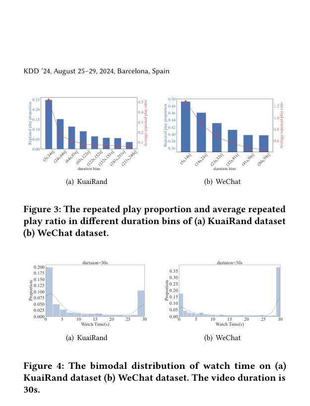

# Counteracting Duration Bias in Video Recommendation via Counterfactual Watch Time

> **保真度：核心机制复现**。原文结论、本地公开数据实验和未复刻部分分开陈述。

## 论文信息

| 项目 | 内容 |
| --- | --- |
| 论文链接 | [arXiv 2406.07932](https://arxiv.org/abs/2406.07932) |
| 公司/机构 | Kuaishou Technology / Renmin University of China |
| 首次公开日期 | 2024-06-12（arXiv v1） |
| 原文开源代码 | 是：[官方/作者代码](https://github.com/hyz20/CWM) |
| Adapter | `cwm` |
| 本地复现代码 | [`src/auto_research/reproductions/cwm/`](https://github.com/daiwk/auto-research/tree/main/src/auto_research/reproductions/cwm/) |

## 原始论文总结

### 背景与主要改动

以反事实观看时长估计消除视频时长偏置：区分观察到的 watch time 与在统一时长干预下的潜在收益。


<!-- paper-figure:start -->
### 原论文关键图

[](https://arxiv.org/pdf/2406.07932#page=4)

> **原论文 Figure 4（关键图）**：展示原论文方法的总体设计和关键组成。图片来自[原论文](https://arxiv.org/abs/2406.07932)，版权归原作者所有；点击图片可查看来源。
<!-- paper-figure:end -->

### 核心公式

$$
\hat y(d_0)=\mathbb E[Y\mid X,do(D=d_0)],\quad s=\hat y(d_0)-\lambda\,\operatorname{bias}(D).
$$

### 论文离线与线上效果

快手 Mean Watch Time +2.9%、Video Views +2.5%、CTR +0.3%。

## 本地复现

> **本地对照口径**：基线为共享 transition + content scorer，实验组只加入 `cwm` 核心机制；相对 NDCG@10 -17.89%。

MovieLens-100K、260 users / 420 items、seed 42：NDCG@10 0.0354 → **0.0291（-17.89%）**。基线是共享 transition + content scorer；实验组只加入论文核心路径。

```bash
auto-research reproduce --paper cwm --dataset-dir data --seed 42
auto-research evolve --model rankmixer --dataset movielens-100k --direction "组合 cwm 与已安装论文算子" --generations 2 --population 4
```

固定指标见 [`metrics/public-seed42.json`](metrics/public-seed42.json)。

## 复现边界

在 MovieLens-100K 全库排序上实际执行论文核心状态、训练目标或推理路径；未使用公司私有特征、生产流量和在线服务，线上 A/B 数字只引用原文。 本地数值不等同于原论文大模型、私有数据、生产流量或专用 kernel；本地相对变化不得与原文提升混写。
