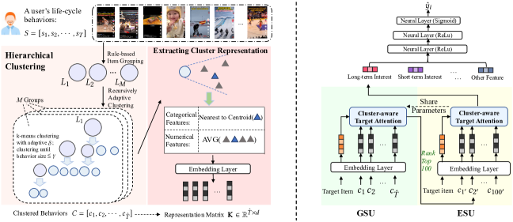

# TWIN V2: Scaling Ultra-Long User Behavior Sequence Modeling for Enhanced CTR Prediction at Kuaishou

> **保真度：核心机制复现**。原文结论、本地公开数据实验和未复刻部分分开陈述。

## 论文信息

| 字段 | 内容 |
|---|---|
| 论文链接 | [CIKM 2024](https://arxiv.org/abs/2407.16357) |
| 公司/机构 | Kuaishou |
| 首次公开日期 | 2024-07-23（arXiv v1） |
| 原文开源代码 | 否：未发现/未发布原作者官方代码仓库（核查日期：2026-08-08） |
| Adapter | `twin-v2` |
| 本地复现代码 | [`src/auto_research/reproductions/twin_v2/`](https://github.com/daiwk/auto-research/tree/main/src/auto_research/reproductions/twin_v2/) |

## 原始论文总结

### 背景与主要改动

离线层次聚类将百万级生命周期行为压缩成带规模信息的虚拟物品；在线 GSU 检索相关簇，ESU 以 cluster-aware target attention 精排。


<!-- paper-figure:start -->
### 原论文关键图

[](https://ar5iv.labs.arxiv.org/html/2407.16357/assets/x2.png)

> **原论文 Figure 2（关键图）**：展示原论文方法的总体设计和关键组成。图片来自[原论文](https://arxiv.org/abs/2407.16357)，版权归原作者所有；点击图片可查看来源。
<!-- paper-figure:end -->

### 核心公式

$$
a_c=q^\top k_c-\tfrac12\log |c|,\quad h=\sum_{c\in\operatorname{TopK}(a)}\sum_{i\in c}\alpha_i v_i.
$$

### 论文离线与线上效果

Kuaishou 三场景 Watch Time +0.672%/+0.800%/+0.728%，已服务约 4 亿 DAU 主流量。

## 本地复现

> **本地对照口径**：基线为 `shared transition + content baseline`，实验组为 `TWIN-V2`，只改变论文核心机制；`ndcg_at_10` 0.0354 → **0.0433，相对基线 +22.45%**。

```bash
auto-research reproduce --paper twin-v2 --dataset-dir data --seed 42
```

固定指标见 [`metrics/public-seed42.json`](metrics/public-seed42.json)。

## 复现边界

在 MovieLens-100K 全库排序上执行论文的候选相关检索、层级压缩或蒸馏目标；未使用公司私有日志与线上 serving，线上 A/B 只引用原文。 本地相对变化不得与原文指标混写。
