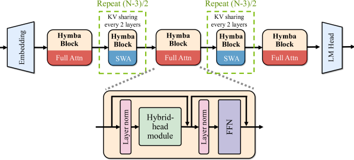

# Hymba: A Hybrid-head Architecture for Small Language Models

> **保真度：核心机制复现**。原文结论、本地公开数据实验和未复刻部分分开陈述。

## 论文信息

| 字段 | 内容 |
|---|---|
| 论文链接 | [arXiv 2411.13676](https://arxiv.org/abs/2411.13676) |
| 公司/机构 | NVIDIA |
| 首次公开日期 | 2024-11-20（arXiv v1） |
| 原文开源代码 | 是：[原作者仓库](https://github.com/NVlabs/hymba) |
| Adapter | `hymba` |
| 本地复现代码 | [`src/auto_research/reproductions/hymba/`](https://github.com/daiwk/auto-research/tree/main/src/auto_research/reproductions/hymba/) |

## 原始论文总结

### 背景与主要改动

同一层并行执行 attention 与状态空间分支，再用输入相关 gate 融合局部精确检索和线性长程状态。


<!-- paper-figure:start -->
### 原论文关键图

[](https://ar5iv.labs.arxiv.org/html/2411.13676/assets/x5.png)

> **原论文 Figure 4（关键图）**：展示原论文提出的核心架构、主要模块及其连接关系。图片来自[原论文](https://arxiv.org/abs/2411.13676)，版权归原作者所有；点击图片可查看来源。
<!-- paper-figure:end -->

### 核心公式

$$
H'=H+g(X)\odot A(X)+(1-g(X))\odot SSM(X).
$$

### 论文离线与线上效果

Hymba-1.5B 在同尺寸模型中报告更优 accuracy、cache 与吞吐折中。

## 本地复现

> **本地对照口径**：基线为同预算 `llama_modern`，实验组为 `hymba`；相对 PPL +8.53%。

WikiText-2、12 steps、64d/2-layer、seed 42：PPL 421.18 → **457.10（+8.53%）**；参数、token、优化器和步数相同。

```bash
auto-research reproduce --paper hymba --dataset-dir data --seed 42
auto-research evolve --model micro-llm --dataset wikitext-2 --direction "组合 hymba 与已安装论文算子" --generations 2 --population 4
```

固定指标见 [`metrics/public-seed42.json`](metrics/public-seed42.json)。

## 复现边界

实际在每层并行执行 causal attention 与深度卷积状态分支，并以输入相关 gate 融合；未复刻 1.5B 参数、meta tokens 和 fused kernel。 本地数值不等同于原论文大模型、私有数据、生产流量或专用 kernel；本地相对变化不得与原文提升混写。
