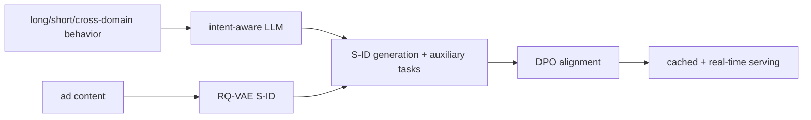

# LEADRE：多面知识增强的 LLM 广告生成式召回

> **Fidelity: 完整核心链路复现**。Semantic ID、长短期/商业意图、语义与价值辅助任务、SFT→DPO 和可缓存/实时双路径均执行；私有广告与生产服务未复刻。

## 原始论文总结
### 背景与主要改动
ID 召回难利用广告内容。LEADRE 以跨域行为、长期总结和实时行为构造 intent-aware prompt，将广告量化为 S-ID，并用广告语义/商业价值辅助任务和 DPO 对齐，线上把长期生成缓存与实时服务组合。

### 核心公式
SFT 联合目标为 $L=L_{SID}+\lambda_sL_{semantic}+\lambda_vL_{value}$；DPO 使用 $-\log\sigma(\beta[(\log\pi_\theta(y_w)-\log\pi_\theta(y_l))-(\log\pi_{ref}(y_w)-\log\pi_{ref}(y_l))])$。
### 论文离线与线上效果
论文 HR@1 0.0764、NDCG@8 0.1360；WeChat Channels/Moments GMV 分别 **+1.57%/+1.17%**，已部署至每日数百亿请求。

## 本地复现
MovieLens-100K，180 users/280 items，seeds 42–44。统一 DIN（100 steps）Hit/NDCG 为 0.0481/0.02167；LEADRE 为 0.0574/0.02447，NDCG 相对 DIN **+12.94%**。但内部消融显示 DPO 相对 SFT 0.02563→0.02447（**-4.53%**），因此收益来自完整 S-ID/SFT 系统而非本地 DPO 阶段。指标见 [`metrics/movielens-100k-seeds42-44.json`](metrics/movielens-100k-seeds42-44.json)。
