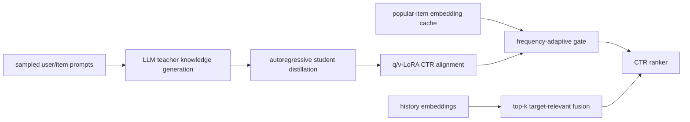

# MSD：把 LLM 知识蒸馏到可缓存、可对齐的 CTR 模型

> **Fidelity: 完整核心链路复现**。真实执行 teacher 知识生成、T5 自回归蒸馏、student q/v-LoRA CTR 对齐、多层特征 adapter、频次自适应缓存/在线计算和相关历史融合；生产广告特征与缓存服务未复刻。

- 论文：[arXiv 2412.06860](https://arxiv.org/abs/2412.06860)，Meituan
- Adapter：`msd`

## 原始论文总结

### 背景与主要改动

直接在 CTR 链路调用大模型效果好但成本不可接受；只缓存静态 embedding 又无法跟随 CTR 目标更新。MSD 的 MKDM 先让大 teacher 为用户和物品生成关键词与推理，再让较小 student 自回归学习这些输出。MKIM 对蒸馏后的 student 做 LoRA CTR 对齐，并用 user/target/history adapter 融合推荐特征。高频物品优先走预计算缓存，低频或未命中物品在线编码，同时只融合与 target 最相关的历史。



### 核心公式

student 对 teacher 输出序列做真实语言建模蒸馏：

$$
\mathcal L_{KD}=-\sum_t\log p_{S}(y_t^{T}\mid x,y_{<t}^{T}).
$$

CTR 阶段冻结 student 主干，只学习低秩更新：

$$
W'=W+\frac{\alpha}{r}BA.
$$

频次门控在缓存表示与 LoRA 在线表示间选择，并融合 top-k 相关历史：

$$
e_i=m(f_i)e_i^{cache}+[1-m(f_i)]e_i^{online},\qquad
\tilde e_i=e_i+\operatorname{Adapter}\left(\operatorname{Mean}(\operatorname{TopK}_{h\in H}\operatorname{sim}(e_i,e_h))\right).
$$

### 论文离线与线上效果

KDD Cup 2012 上 DeepFM AUC 0.7763、PRINT 0.7846、MSD **0.7871**；美团私有数据上 DeepFM 0.6938、MSD **0.7087**。消融中去掉 LoRA 为 0.7075，去掉 item fusion 为 0.7069，去掉 user knowledge 为 0.7054。

美团搜索广告 2024-10-20 至 10-30 线上 A/B：CTR **+2.12%**、CPM **+2.59%**。论文报告 baseline 35ms、MSD 37.2ms。

## 本地复现

> **本地对照口径**：基线是 ID-only CTR ranker；实验组是完整 MSD；AUC 从 0.68449 升至 0.69510（**+1.55%**）。这是 LLM 蒸馏与缓存语义特征的联合消融，不是相对 DIN。

MovieLens-100K 的标题、类型和时间序列构成 CTR 任务。SmolLM2-135M-Instruct teacher 为 30 个用户与 160 个按频次分层选取的物品真实生成知识；T5-small 用 32 steps 自回归蒸馏。随后冻结 student，注入 **147,456** 个 q/v-LoRA 参数，执行 100 steps CTR 对齐。高频 item 使用缓存表示，低频 item 保留在线 LoRA 路径；历史按与 target 的语义相似度取 top-3。

| Method | AUC mean ± std | train+eval seconds mean |
|---|---:|---:|
| ID CTR | 0.684486 ± 0.005765 | **约 1.1** |
| MSD | **0.695098 ± 0.024651** | 约 22.0 |

MSD AUC 平均相对 **+1.55%**，2/3 seeds 正向；seed 44 为负，因此不是稳定增益。三个 seed 的蒸馏 loss 分别从 2.40/2.38/2.36 降至 1.55/1.13/1.17，teacher→student 阶段确实执行。本机耗时明显不具论文生产效率：这里只复刻频次门控与缓存语义，没有美团的异步批处理和线上 embedding 服务。指标见 [`metrics/movielens-100k-seeds42-44.json`](metrics/movielens-100k-seeds42-44.json)。

```bash
pip install -e '.[plum]'
for seed in 42 43 44; do
  AUTO_RESEARCH_MSD_USERS=30 AUTO_RESEARCH_MSD_TEACHER_ITEMS=160 \
  AUTO_RESEARCH_MSD_DISTILL_STEPS=32 AUTO_RESEARCH_MSD_STEPS=100 \
  auto-research reproduce --paper msd --dataset-dir data --seed "$seed"
done
```

teacher 文本、student checkpoint、缓存 embedding 与原始 runs 都位于 Git 忽略目录；仓库只提交汇总指标。
