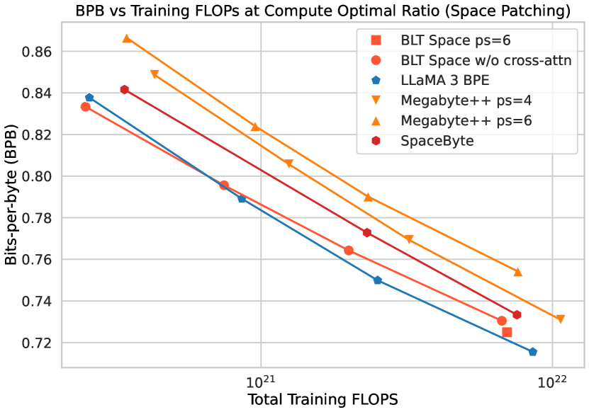

# Byte Latent Transformer: Patches Scale Better Than Tokens

> **保真度：核心机制复现**。原文结论、本地公开数据实验和未复刻部分分开陈述。

## 论文信息

| 项目 | 内容 |
| --- | --- |
| 论文链接 | [arXiv 2412.09871](https://arxiv.org/abs/2412.09871) |
| 公司/机构 | Meta FAIR |
| 首次公开日期 | 2024-12-13（arXiv v1） |
| 原文开源代码 | 是：[官方/作者代码](https://github.com/facebookresearch/blt) |
| Adapter | `blt` |
| 本地复现代码 | [`src/auto_research/reproductions/blt/`](https://github.com/daiwk/auto-research/tree/main/src/auto_research/reproductions/blt/) |

## 原始论文总结

### 背景与主要改动

直接处理 byte，并依据 next-byte entropy 动态形成 patch；全局 Transformer 在 patch 级计算，局部编码器/解码器恢复 byte。


<!-- paper-figure:start -->
### 原论文关键图

[](https://ar5iv.labs.arxiv.org/html/2412.09871/assets/x6.png)

> **原论文 Figure 6（关键图）**：展示原论文提出的核心架构、主要模块及其连接关系。图片来自[原论文](https://arxiv.org/abs/2412.09871)，版权归原作者所有；点击图片可查看来源。
<!-- paper-figure:end -->

### 核心公式

$$
b_t=\mathbf1[H(x_{t+1}|x_{\le t})>\tau],\quad z_k=E(x_{s_k:e_k}),\quad p(x)=D(T(z),x_{<t}).
$$

### 论文离线与线上效果

原文显示 byte patch 在固定 FLOPs 下具有更好的 scaling，并提升噪声与多语鲁棒性。

## 本地复现

> **本地对照口径**：基线为同预算 `llama_modern`，实验组为 `blt`；相对 PPL -2.13%。

WikiText-2、12 steps、64d/2-layer、seed 42：PPL 421.18 → **412.21（-2.13%）**；参数、token、优化器和步数相同。

```bash
auto-research reproduce --paper blt --dataset-dir data --seed 42
auto-research evolve --model micro-llm --dataset wikitext-2 --direction "组合 blt 与已安装论文算子" --generations 2 --population 4
```

固定指标见 [`metrics/public-seed42.json`](metrics/public-seed42.json)。

## 复现边界

实际执行可学习 surprisal boundary、相邻低熵位置 latent patch 共享并展开回原目标；当前 evaluator 的 512-symbol tokenizer 只近似 byte alphabet，未复刻 8B BLT 与完整 local encoder/decoder。 本地数值不等同于原论文大模型、私有数据、生产流量或专用 kernel；本地相对变化不得与原文提升混写。
