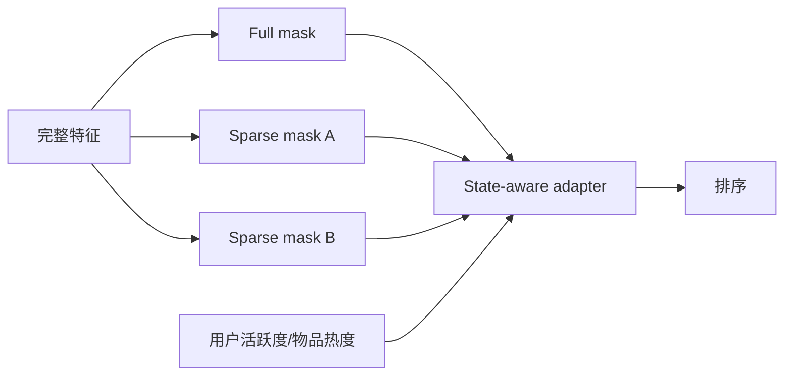
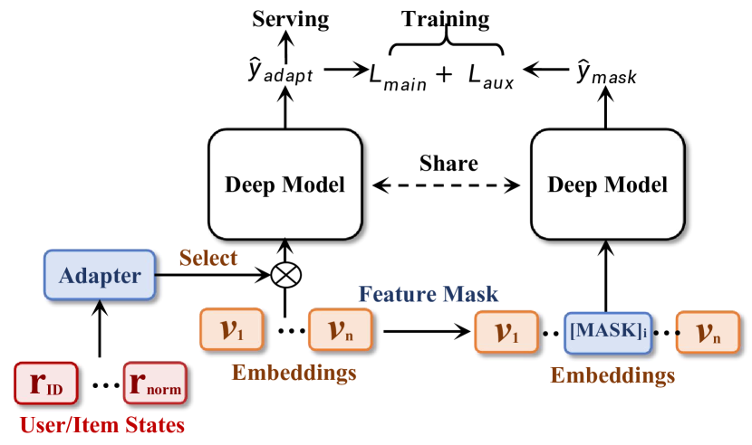

# AdaF²M²：多前向特征学习与状态自适应

> **Fidelity: 核心机制复现**。实际执行三组 feature-mask 前向、共享聚合与用户/物品状态自适应 adapter。

## 论文信息

| 项目 | 内容 |
| --- | --- |
| 论文链接 | [arXiv 2501.15816](https://arxiv.org/abs/2501.15816) |
| 公司/机构 | ByteDance / Douyin |
| 首次公开日期 | 2025-01-27（arXiv v1） |
| 原文开源代码 | 否：论文未提供官方/作者代码（核查日期：2026-07-28） |
| Adapter | `adaf2m2` |
| 本地复现代码 | [`src/auto_research/reproductions/adaf2m2/`](https://github.com/daiwk/auto-research/tree/main/src/auto_research/reproductions/adaf2m2/) |

## 原始论文总结

### 背景与主要改动

单次全特征前向容易过度依赖强特征，且不同用户/物品状态需要不同特征。AdaF²M² 通过多种 mask 重复前向学习互补表示，再以 state-aware adapter 动态融合。



<!-- paper-figure:start -->
### 原论文关键图

[](https://ar5iv.labs.arxiv.org/html/2501.15816/assets/x1.png)

> **原论文 Figure 1（关键图）**：展示原论文提出的核心架构、主要模块及其连接关系。图片来自[原论文](https://arxiv.org/abs/2501.15816)，版权归原作者所有；点击图片可查看来源。
<!-- paper-figure:end -->

### 核心公式

$$
h_k=f(x\odot m_k),\qquad
h=\sum_k \alpha_k(s)h_k,\quad
\alpha(s)=\operatorname{softmax}(W_s s).
$$

### 论文离线与线上效果

论文在多个私有场景报告 mask multi-forward 与 adapter 的离线增益；抖音线上累计活跃天数 `+1.37%`、App 时长 `+1.89%`，并部署到召回、排序与冷启动。

## 本地复现

> **本地对照口径**：相对单前向全特征基线，实验组 NDCG@10 `+2.42%`。

相对单前向全特征模型：NDCG@10 `0.07514→0.07696`（`+2.42%`），head share `0.21762→0.15976`。指标见 [`metrics/movielens-1m-seed42.json`](metrics/movielens-1m-seed42.json)。

```bash
auto-research reproduce --paper adaf2m2 --dataset-dir data --seed 42
```

## 复现边界

状态仅由历史长度和物品热度构造；没有抖音私有特征、全链路联合训练和线上资源成本。
