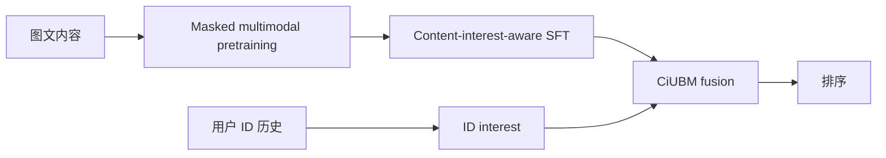

# MIM：多模态内容兴趣建模

> **Fidelity: 核心机制复现**。实际执行遮盖内容重建、内容—协同对比对齐和 CiUBM 风格兴趣融合。

## 论文信息

| 项目 | 内容 |
| --- | --- |
| 论文链接 | [arXiv 2502.00321](https://arxiv.org/abs/2502.00321) |
| 公司/机构 | Alibaba / Taobao |
| 首次公开日期 | 2025-02-01（arXiv v1） |
| 原文开源代码 | 是：[官方/作者代码](https://pan.quark.cn/s/8fc8ec3e74f3) |
| Adapter | `mim` |
| 本地复现代码 | [`src/auto_research/reproductions/mim/`](https://github.com/daiwk/auto-research/tree/main/src/auto_research/reproductions/mim/) |

## 原始论文总结

### 背景与主要改动

纯 ID 行为模型难以理解新品内容。MIM 先遮盖重建多模态内容，再用 content-interest-aware SFT 对齐内容与协同兴趣，最后由 CiUBM 融合内容兴趣和 ID 兴趣。



### 核心公式

核心目标可写为

$$
\mathcal L=\mathcal L_{\mathrm{mask}}+\lambda\mathcal L_{\mathrm{align}}+
\mathcal L_{\mathrm{rank}},\qquad
s(u,i)=g(i_u^{ID},i_u^{content})^\top e_i .
$$

### 论文离线与线上效果

论文在淘宝私有离线集合报告 MIM 及 CiUBM 优于纯 ID/内容基线；不同业务表格没有给出可合并的统一离线 lift。线上 CTR `+14.14%`、RPM `+4.12%`。

## 本地复现

> **本地对照口径**：相对 ID 共现兴趣基线，实验组 NDCG@10 `+0.94%`。

MovieLens-1M 420 users / 640 items、leave-two-out、全目录排序。相对 ID 共现兴趣基线：Hit@10 `0.14048→0.12143`，NDCG@10 `0.07514→0.07584`（`+0.94%`），MRR@10 `0.05541→0.06228`。完整指标见 [`metrics/movielens-1m-seed42.json`](metrics/movielens-1m-seed42.json)。

```bash
auto-research reproduce --paper mim --dataset-dir data --seed 42
```

## 复现边界

genre 代理图文模态；没有淘宝私有曝光、真实多模态 encoder 与生产 serving。本地与论文线上数值不可直接比较。
