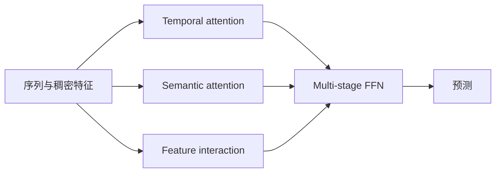
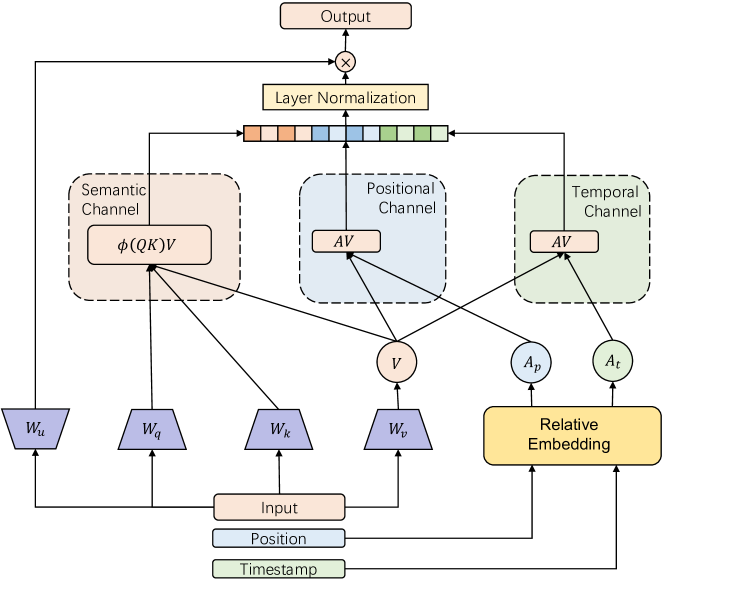

# FuXi-α：特征交互增强 Transformer

> **Fidelity: 核心机制复现**。实际执行时间、语义和流行度多通道注意力及分阶段交互门控。

## 论文信息

| 项目 | 内容 |
| --- | --- |
| 论文链接 | [arXiv 2502.03036](https://arxiv.org/abs/2502.03036) |
| 公司/机构 | Huawei / USTC |
| 首次公开日期 | 2025-02-05（arXiv v1） |
| 原文开源代码 | 是：[官方/作者代码](https://github.com/USTC-StarTeam/FuXi-alpha) |
| Adapter | `fuxi-alpha` |
| 本地复现代码 | [`src/auto_research/reproductions/fuxi_alpha/`](https://github.com/daiwk/auto-research/tree/main/src/auto_research/reproductions/fuxi_alpha/) |

## 原始论文总结

### 背景与主要改动

常规推荐 Transformer 扩参时容易受浅层特征交互限制。FuXi-α 用多个自适应交互通道建模不同关系，再以 multi-stage FFN 逐级融合。



<!-- paper-figure:start -->
### 原论文关键图

[](https://ar5iv.labs.arxiv.org/html/2502.03036/assets/x3.png)

> **原论文 Figure 3（关键图）**：展示原论文方法的总体设计和关键组成。图片来自[原论文](https://arxiv.org/abs/2502.03036)，版权归原作者所有；点击图片可查看来源。
<!-- paper-figure:end -->

### 核心公式

$$
H_c=\operatorname{softmax}(Q_cK_c^\top/\sqrt d)V_c,\qquad
H^{l+1}=H^l+\operatorname{FFN}_l([H^l,H_1,H_2,H_3]).
$$

### 论文离线与线上效果

论文在 MovieLens-1M、KuaiRand 和工业数据上报告随规模扩大持续改善；线上 30% 流量 7 天，播放歌曲数 `+4.67%`、收听时长 `+5.10%`。

## 本地复现

> **本地对照口径**：相对单通道注意力基线，实验组 NDCG@10 `-4.25%`。

NDCG@10 `0.07514→0.07194`（`-4.25%`），Hit@10 `0.14048→0.14286`；命中略升但排序质量下降，保留负结果。指标见 [`metrics/movielens-1m-seed42.json`](metrics/movielens-1m-seed42.json)。

```bash
auto-research reproduce --paper fuxi-alpha --dataset-dir data --seed 42
```

## 复现边界

本地是小型数值通道实现，不包含论文十亿级 scaling、华为音乐私有连续特征与分布式训练。
