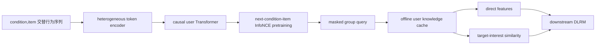

# LUM：生成式用户知识构建、条件查询，再回到判别式推荐

> **Fidelity: 完整核心链路复现**。真实执行 condition/item 异构 token encoder、causal next-condition-item InfoNCE、屏蔽式 group query、离线知识缓存、direct feature、interest matching 与下游 CTR DLRM；不声称复现 7B scaling law。

## 论文信息

| 项目 | 内容 |
| --- | --- |
| 论文链接 | [arXiv 2502.08309](https://arxiv.org/abs/2502.08309) |
| 公司/机构 | Alibaba |
| 首次公开日期 | 2025-02-12（arXiv v1） |
| 原文开源代码 | 否：论文未提供官方/作者代码（核查日期：2026-07-22） |
| Adapter | `lum` |
| 本地复现代码 | [`src/auto_research/reproductions/lum/`](https://github.com/daiwk/auto-research/tree/main/src/auto_research/reproductions/lum/) |

## 原始论文总结

### 背景与主要改动

端到端生成推荐能够扩展 Transformer 参数，却难以兼容长期演化的线上 DLRM、复杂特征和毫秒延迟。LUM 将问题拆成三步：先用生成任务构建用户知识，再用条件 token 离线查询不同兴趣，最后把固定知识特征接入任意判别式 DLRM。关键 token 顺序是 `<condition, item>`：condition 描述即将预测的 item 所属场景、搜索词或类别，而不是事后附着在上一 item 上的 action。



### 核心公式

异构 token 特征先分别投影：

$$
e^t=\operatorname{proj}^t(\operatorname{concat}(f_1^t,f_2^t,\ldots)),\quad t\in\{c,i\}.
$$

生成目标只落在 condition 输出上，预测紧随其后的 item：

$$
p(c_1,i_1,\ldots,c_L,i_L)=\prod_{l=1}^{L}p(i_l\mid c_1,i_1,\ldots,i_{l-1},c_l),
$$
$$
\mathcal L=-\sum_l\log\frac{\exp(\operatorname{sim}(o_l^c,e_l^i))}{\exp(\operatorname{sim}(o_l^c,e_l^i))+\sum_k\exp(\operatorname{sim}(o_l^c,e_k^i))}.
$$

Step 2 在公共历史 prefix 后一次追加多个 query condition，并屏蔽 query-query attention。Step 3 同时使用知识向量和目标匹配分数：

$$
\hat y=f\left(u,i,\{o_{q_n}^i,\operatorname{sim}(o_{q_n}^i,e_i^i)\}_{n=1}^{N},e_i^i\right).
$$

### 论文离线与线上效果

公共数据 AUC：ML-1M 上 LUM **0.7615**（SIM 0.7579、HSTU 0.7533）；ML-20M 为 **0.7483**；Amazon Books 为 **0.6727**。工业数据上 LUM ranking AUC 0.7514，比线上模型 0.7338 高 0.0176；R@10/R@50 分别提升 0.0133/0.0134。

packing 将 Step 1 从 151h 降到 26h（-82%），group query 将 Step 2 从 17h 降到 3.6h（-78%）。淘宝赞助搜索线上 A/B：CTR **+2.9%**、RPM **+1.2%**。

## 本地复现

> **本地对照口径**：基线是 ID-DLRM；实验组是加入 LUM 离线知识的相同下游 DLRM；AUC 从 0.58233 升至 0.66734（**+14.60%**）。这是 LUM 知识特征消融，不是相对 DIN。

使用论文原本就采用的 MovieLens-1M。评分行为离散为低/中/高三个真实 condition，并严格置于对应 item 之前；item token 融合 ID 与官方 genre。1,000 用户产生 121,734 个无 test 泄漏的预训练样本。Step 1 训练 200 steps；Step 2 对每条样本一次查询三个 condition，并用 query block mask 共享历史 prefix；Step 3 缓存知识，训练 160 steps 的 ID-DLRM 或 LUM 增强 DLRM。

| Method | AUC mean ± std |
|---|---:|
| ID-DLRM | 0.582330 ± 0.017945 |
| LUM + DLRM | **0.667337 ± 0.007308** |

LUM 增强后 AUC 相对 **+14.60%**，3/3 seeds 正向。三个 seed 的 Step 1 loss 分别从 4.624/4.617/4.646 降至 4.411/4.391/4.402。较大增幅来自轻量 ID-DLRM 原本没有序列特征，而 LUM 同时加入固定用户知识、item knowledge 和三路 similarity；它证明三步知识利用有效，但不能外推成 7B scaling law。指标见 [`metrics/movielens-1m-seeds42-44.json`](metrics/movielens-1m-seeds42-44.json)。

```bash
pip install -e '.[neural-recs]'
for seed in 42 43 44; do
  AUTO_RESEARCH_LUM_USERS=1000 AUTO_RESEARCH_LUM_PRETRAIN_STEPS=200 \
  AUTO_RESEARCH_LUM_STEPS=160 AUTO_RESEARCH_LUM_TRAIN=6000 \
  AUTO_RESEARCH_LUM_TEST=1500 \
  auto-research reproduce --paper lum --dataset-dir data --seed "$seed"
done
```

数据、逐次 runs、知识 cache 与 checkpoint 均不提交 Git。
