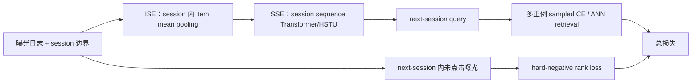

# SessionRec：从预测下一个物品改为预测下一个 session

> **Fidelity: 核心机制复现**。真实执行 session 内聚合、session 间 Transformer、多正例 next-session retrieval，以及 session 内曝光负例排序损失；私有特征与 ANN 服务未复刻。

- 论文：[arXiv 2502.10157](https://arxiv.org/abs/2502.10157)，Meituan
- Adapter：`sessionrec`；代码：`src/auto_research/reproductions/sessionrec/`

## 原始论文总结

### 背景与主要改动

逐物品 next-item 训练把同一消费意图中的多个物品硬排成先后标签，也无法把“下一次访问会同时消费的一组物品”作为多正例。SessionRec 先由 Item-based Session Encoder（ISE）把一次访问中的物品聚合为 session token，再由 Session-based Sequence Encoder（SSE）建模跨 session 兴趣迁移，最终让一个 query 同时召回下一 session 的所有正例。原文比较了 pooling/attention/Transformer 等 ISE，均值池化效果最好；SSE 可用 Transformer 或 HSTU。



### 核心公式

均值 ISE 与 SSE 为：

$$s_t=\frac{1}{|S_t|}\sum_{i\in S_t}e_i,\qquad
q_t=\operatorname{SSE}(s_1,\ldots,s_t)_{t}. $$

下一 session 的全部物品构成正例集合 $P_{t+1}$，曝光但未发生正反馈的物品构成困难负例 $N_{t+1}$：

$$\mathcal L=\mathcal L_{multi\text{-}positive\ retrieval}
+\alpha\frac{1}{|P||N|}\sum_{p\in P,n\in N}\log(1+e^{q^\top e_n-q^\top e_p}).$$

本地训练从多正例中轮采一个 CE target，并保留整个正例集合用于评估；困难负例直接来自同一 session 的真实未点击曝光，不从全库伪造。

### 论文离线与线上效果

KuaiSAR 的 leave-one-session-out 实验中，SessionRec-HSTU 的 Recall@500 / NDCG@500 为 **0.3318 / 0.1287**；HSTU 为 0.2009 / 0.0701，HSTU+ 为 0.2212 / 0.0785。

Meituan 首页替换线上 SASRec，7 天 A/B：Pay PV **+0.603%**，PVCTCVR **+0.564%**。

## 本地复现

使用已下载的 KuaiRand-Pure 标准流量曝光日志：按 30 分钟间隔切 session，`is_click=1` 或 `long_view=1` 为正反馈，同 session 其余曝光作为困难负例。逐用户最后两个有效 session 分别作 validation/test；与扁平 item Transformer 做相同维度、层数、步数和候选采样预算的对照。这里没有用 MovieLens，因为原论文明确指出它缺少 session 与负曝光。

先在 seed 42 的 validation 上搜索论文建议的小权重 $\alpha\in\{0,0.01,0.1\}$；0 与 0.01 的 NDCG@20 同为 0.002856，选择保留困难负例目标的 **0.01**，不根据 test 反选。

| Method | Recall@20 mean ± std | NDCG@20 mean ± std | train+eval seconds |
|---|---:|---:|---:|
| Item Transformer | **0.011894 ± 0.002272** | **0.004718 ± 0.000924** | 11.32 |
| SessionRec Transformer | 0.009302 ± 0.001201 | 0.003678 ± 0.000640 | **10.53** |

SessionRec 的 NDCG@20 相对低 **22.05%**，仅 1/3 seeds 正向，因此本地没有复现论文增益。当前子集每个用户只有少量有效 session，且短视频 session 内兴趣可能并不单一；均值 ISE 会损失细粒度顺序，都是合理解释，但不能从现有实验断言因果。结构化指标见 [`metrics/kuairand-pure-seeds42-44.json`](metrics/kuairand-pure-seeds42-44.json)。

```bash
pip install -e '.[neural-recs]'
for seed in 42 43 44; do
  AUTO_RESEARCH_SESSIONREC_ROWS=350000 \
  AUTO_RESEARCH_SESSIONREC_USERS=2000 \
  AUTO_RESEARCH_SESSIONREC_STEPS=180 \
  auto-research reproduce --paper sessionrec --dataset-dir data --seed "$seed"
done
```

数据压缩包、展开文件、逐次运行和 checkpoint 均由 `.gitignore` 排除；Git 只保存复核后的 JSON 指标。
