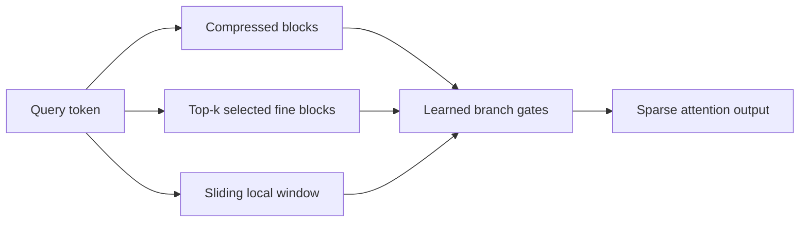
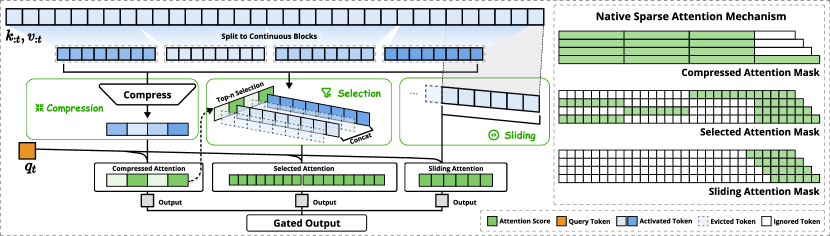

# Native Sparse Attention：可训练的三路稀疏注意力

> **Fidelity: 核心机制复现**。真实训练压缩、选择和滑窗三条注意力分支；未复刻论文的 Triton kernel 与 27B 训练。

## 论文信息

| 项目 | 内容 |
| --- | --- |
| 论文链接 | [arXiv 2502.11089](https://arxiv.org/abs/2502.11089) |
| 公司/机构 | DeepSeek |
| 首次公开日期 | 2025-02-16（arXiv v1） |
| 原文开源代码 | 否：论文未提供官方/作者代码（核查日期：2026-07-28） |
| Adapter | `native-sparse-attention` |
| 本地复现代码 | [`src/auto_research/reproductions/native_sparse_attention/`](https://github.com/daiwk/auto-research/tree/main/src/auto_research/reproductions/native_sparse_attention/) |

## 原始论文总结

### 背景与主要改动

全注意力的计算和 KV 读取随上下文长度平方增长。NSA 不是在训练后裁剪 attention，而是从预训练开始并行学习三条路径：压缩历史块负责全局轮廓，query 相关的 block selection 恢复重要细节，滑窗保留近期精确信息；三路输出再由可学习门控融合。



<!-- paper-figure:start -->
### 原论文关键图

[](https://ar5iv.labs.arxiv.org/html/2502.11089/assets/x2.png)

> **原论文 Figure 2（关键图）**：展示原论文提出的核心架构、主要模块及其连接关系。图片来自[原论文](https://arxiv.org/abs/2502.11089)，版权归原作者所有；点击图片可查看来源。
<!-- paper-figure:end -->

### 核心公式

$$
o_t=\sum_{b\in\{\mathrm{cmp},\mathrm{sel},\mathrm{win}\}}
g_{t,b}\operatorname{Attn}_b(q_t,K_b,V_b),\qquad
g_t=\operatorname{softmax}(W_g h_t).
$$

压缩分支对历史 block 聚合，选择分支依据 $q_t$ 与压缩 key 的相似度选 top-$k$ block，滑窗分支只读取 $[t-w+1,t]$，三者均保持因果性。

### 论文离线与线上效果

论文在通用、长上下文和 instruction reasoning benchmark 上达到或超过 full attention，并在 64K 序列的 decoding、forward、backward 均报告显著加速。纯 LLM 论文不适用线上 A/B 门槛；本地 PyTorch 参考核不复述为硬件吞吐复现。

## 本地复现

> **本地对照口径**：基线是同维度、层数、token、AdamW 和 30-step 预算的 `llama_modern`；实验组只替换为 NSA，WikiText-2 LM loss `5.7471→5.7149`，相对 **-0.56%**，PPL 相对 **-3.17%**。

本地序列长度为 64，NSA 实际读取的 attention-edge proxy 为 full causal attention 的 `56.35%`；这是算法边数，不是 wall-clock 加速。稳定结果见 [`metrics/wikitext2-seed42.json`](metrics/wikitext2-seed42.json)。

```bash
auto-research reproduce --paper native-sparse-attention --dataset-dir data --seed 42
auto-research evolve --model micro-llm --dataset wikitext-2 \
  --direction "组合 Native Sparse Attention、Gated Attention 和 Muon"
```

## 复现边界

未执行 27B continued pretraining、64K benchmark 和定制 Triton kernel；结果只支持“核心三路算子可训练且在当前短预算有效”，不能外推论文的规模或速度结论。
