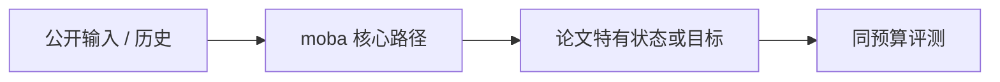
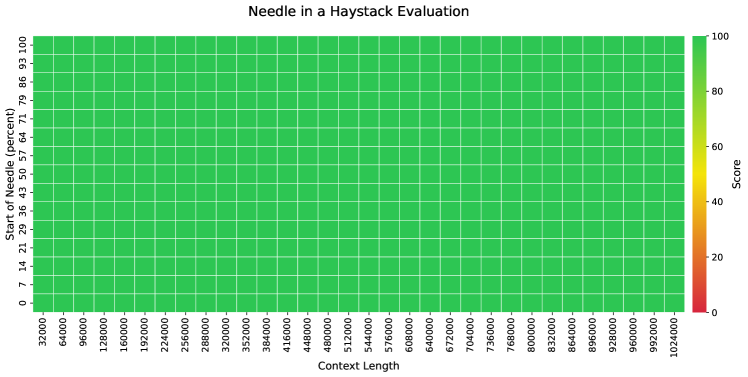

# MoBA: Mixture of Block Attention for Long-Context LLMs

> **保真度：核心机制复现**。原文结论、本地公开数据实验和未复刻部分分开陈述。

## 论文信息

| 字段 | 内容 |
|---|---|
| 论文链接 | [arXiv 2502.13189](https://arxiv.org/abs/2502.13189) |
| 公司/机构 | Moonshot AI |
| 首次公开日期 | 2025-02-18（arXiv v1） |
| 原文开源代码 | 是：[原作者仓库](https://github.com/MoonshotAI/MoBA) |
| Adapter | `moba` |
| 本地复现代码 | [`src/auto_research/reproductions/moba/`](https://github.com/daiwk/auto-research/tree/main/src/auto_research/reproductions/moba/) |

## 原始论文总结

### 背景与主要改动

把序列切成 block，以可微 router 为每个 query 选择少量相关块，同时保留当前因果块。



<!-- paper-figure:start -->
### 原论文关键图

[](https://ar5iv.labs.arxiv.org/html/2502.13189/assets/x12.png)

> **原论文 Figure 7（关键图）**：展示原论文方法的总体设计和关键组成。图片来自[原论文](https://arxiv.org/abs/2502.13189)，版权归原作者所有；点击图片可查看来源。
<!-- paper-figure:end -->

### 核心公式

$$
A(q)=\operatorname{softmax}(qK_{\mathcal B(q)}^\top)V_{\mathcal B(q)},\quad\mathcal B(q)=\operatorname{TopK}_b r(q,b).
$$

### 论文离线与线上效果

原文在长上下文训练中以稀疏计算逼近 full attention，并扩展到百万 token。

## 本地复现

> **本地对照口径**：基线为同预算 `llama_modern`，实验组为 `moba`；相对 PPL +0.49%。

WikiText-2、12 steps、64d/2-layer、seed 42：PPL 421.18 → **423.25（+0.49%）**；参数、token、优化器和步数相同。

```bash
auto-research reproduce --paper moba --dataset-dir data --seed 42
auto-research evolve --model micro-llm --dataset wikitext-2 --direction "组合 moba 与已安装论文算子" --generations 2 --population 4
```

固定指标见 [`metrics/public-seed42.json`](metrics/public-seed42.json)。

## 复现边界

实际将历史划分为 8-token blocks，以 query 对 block key centroid 的相似度选择 top-2 causal blocks，再在命中块内执行精确 attention；PyTorch reference 未复刻百万上下文 fused kernel。 本地数值不等同于原论文大模型、私有数据、生产流量或专用 kernel；本地相对变化不得与原文提升混写。
