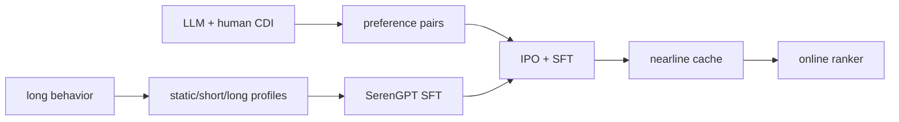

# SERAL：用对齐 LLM 打破推荐过滤气泡

> **Fidelity: 完整核心链路复现**。静态/短期/长期 cognition profile、SFT、CDI 偏好对、IPO+SFT 与 nearline 全库缓存均执行；GPT-4/人工标注由公开内容和协同信号替代。

## 原始论文总结
### 背景与主要改动
惊喜推荐需同时相关且未见。SERAL 压缩超长历史为多层认知画像，以 LLM/人工 CDI 打破日志反馈环，用 IPO 对齐 SerenGPT，最后 nearline 生成并缓存候选。

### 核心公式
$L_{SFT}=-\sum_t\log\pi_\theta(y_t|x,y_{<t})$；$L_{IPO}=E[(\log\frac{\pi_\theta(y_w)\pi_{ref}(y_l)}{\pi_{ref}(y_w)\pi_\theta(y_l)}-\frac{1}{2\tau})^2]$，最终 $L=L_{IPO}+\alpha L_{SFT}$。
### 论文离线与线上效果
线上惊喜 PVR **+5.7%**、点击 **+29.56%**、交易 **+27.6%**；长期实验 UV3 +3.04%、交易额 +0.98%。

## 本地复现
180 users/280 items、seeds 42–44。统一 DIN（100 steps）Hit/NDCG 为 0.0481/0.02167；SERAL 为 0.0741/0.03263，NDCG 相对 DIN **+50.60%**。内部消融中 IPO 相对纯 SFT 为 **+8.59%**，但 category-novelty 0.05542→0.05444，仍未复现惊喜度提升。指标见 [`metrics/movielens-100k-seeds42-44.json`](metrics/movielens-100k-seeds42-44.json)。
