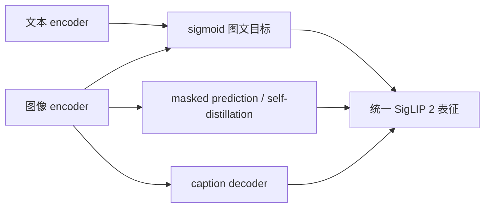
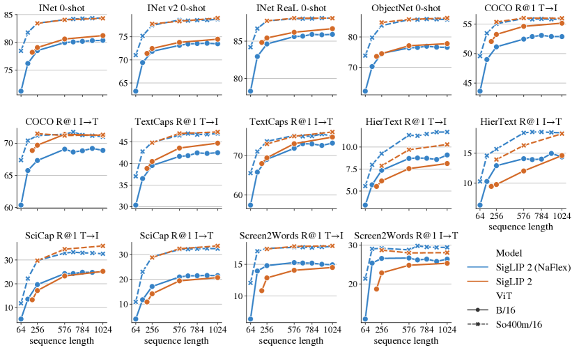

# SigLIP 2：sigmoid 图文对齐与 masked-view 自蒸馏

> **保真度：核心机制复现**。本地执行 sigmoid 对比目标与遮盖视图自蒸馏；未复刻多语言 web 数据、caption decoder 和 dense localization。

## 论文信息

| 项目 | 内容 |
| --- | --- |
| 论文链接 | [arXiv 2502.14786](https://arxiv.org/abs/2502.14786) |
| 公司/机构 | Google DeepMind |
| 首次公开日期 | 2025-02-20（arXiv v1） |
| 原文开源代码 | 是：[Google big_vision](https://github.com/google-research/big_vision) |
| Adapter | `siglip2` |
| 本地复现代码 | [`src/auto_research/reproductions/siglip2/`](https://github.com/daiwk/auto-research/tree/main/src/auto_research/reproductions/siglip2/) |

## 原始论文总结

### 背景与主要改动

SigLIP 2 在 SigLIP 的 pairwise sigmoid loss 上组合 captioning pretraining、global-local
self-distillation、masked prediction、在线数据筛选和 NaFlex 动态分辨率，改善语义、定位、
dense feature 与多语言公平性。



<!-- paper-figure:start -->
### 原论文关键图

[](https://ar5iv.labs.arxiv.org/html/2502.14786/assets/x3.png)

> **原论文 Figure 3（关键图）**：展示原论文的训练流程与关键优化环节。图片来自[原论文](https://arxiv.org/abs/2502.14786)，版权归原作者所有；点击图片可查看来源。
<!-- paper-figure:end -->

### 核心公式

$$
\mathcal L_{\mathrm{sigmoid}}=
\frac1{|B|}\sum_{i,j}\log\left(1+\exp\left[-z_{ij}
(t\,I_i^\top T_j+b)\right]\right),\quad z_{ij}\in\{-1,+1\}.
$$

### 论文离线与线上效果

论文报告四种规模均超过对应 SigLIP，在 zero-shot classification、retrieval、迁移、定位和
dense prediction 上全面改善，并发布 B/L/So400m/g checkpoints；没有工业线上 A/B。

## 本地复现

> **本地对照口径**：基线为均匀标签检索 `10.0%`，实验组为 sigmoid 对比 + masked-view 自蒸馏，test accuracy **66.9%（+56.9 points）**，打乱图降至 10.8%。

```bash
auto-research reproduce --paper siglip2 --dataset-dir data --seed 42
```

固定指标见 [`metrics/fashion-mnist-qa-seed42.json`](metrics/fashion-mnist-qa-seed42.json)。

## 复现边界

Fashion-MNIST 类别文本替代多语言 caption；实际训练 sigmoid pair loss 和中心遮盖视图的
student-teacher consistency，没有复刻 caption decoder、active curation、NaFlex 和定位头。
